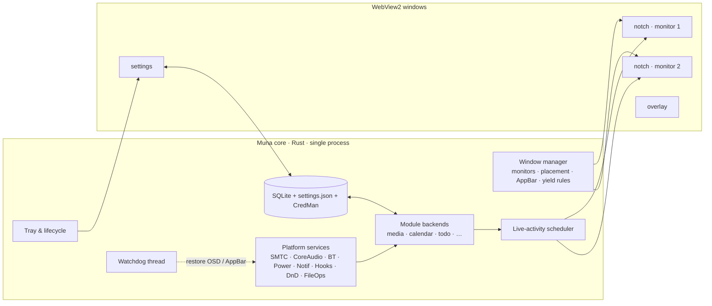

# 03 · Architecture & tech stack

Decision record: [ADR-0001 Tech stack](adr/0001-tech-stack.md) ·
[ADR-0002 Window strategy](adr/0002-window-strategy.md) ·
[ADR-0003 Packaging & identity](adr/0003-packaging-identity.md) ·
[ADR-0004 Module contract](adr/0004-module-contract.md)

## Stack at a glance

| Layer | Choice | Why |
| ------- | -------- | ----- |
| App shell | **Tauri v2** (Rust core + WebView2) | Transparent frameless always-on-top windows with per-pixel alpha, click-through control, tray, autostart, updater, multi-window — at ~1/3 of Electron's RAM. Rust gives direct, safe access to Win32/WinRT via the `windows` crate without a second runtime. |
| UI | **React 19 + TypeScript 6** | Same stack as the marketing sites; largest ecosystem for motion, headless a11y primitives and design-system tooling; lets the landing page reuse the component library. |
| Styling | **Tailwind CSS v4** + CSS custom-property tokens (`@theme`) | Token-first; zero-runtime; design tokens shared with docs/site. |
| Motion | **Motion (framer-motion v12+)** as primary; CSS `linear()` springs for micro-states | `layout` morphs, `AnimatePresence`, spring physics with interruptibility — the closest web analogue to SwiftUI's springs. |
| State | **Zustand** (UI) + **TanStack Query** (remote data) + typed Tauri events | Small, explicit, testable. |
| IPC types | **tauri-specta** (Rust → TS bindings) + **zod** at boundaries | One source of truth for commands/events. |
| Storage | **SQLite** via `rusqlite` (bundled) + JSON settings (versioned) + Windows Credential Manager | Local-first; migrations in Rust. |
| Platform | `windows` crate (WinRT + Win32), `windows-core`, `sysinfo`, `cpal`/WASAPI, `image`, `zip`, `notify`, `tokio` | Media (SMTC), Core Audio, Bluetooth, Power, notifications listener, monitors, AppBar, hooks, drag-drop, file ops. |
| Build/CI | pnpm + Vite, cargo, GitHub Actions (`ubuntu-latest` + `windows-latest`, rules in [11](11-ci-cd.md)), release-please; Tauri updater; MSIX + NSIS | Reproducible signed releases. |
| Quality | Vitest + React Testing Library, Playwright (WebView2), `cargo test`, `cargo clippy -D warnings`, ESLint (typed) + Prettier + Stylelint, Storybook for the design system, Lighthouse-style perf script for animation FPS | Budgets from the PRD enforced in CI. |

Escape hatches (see [ADR-0001](adr/0001-tech-stack.md) consequences): if the M0 spike shows
WebView2 transparency is unreliable for the always-visible strip, render the *collapsed* strip
in a native Direct2D/Composition layered window driven by the same Rust state (EchoIsland
pattern) and keep WebView2 for expanded states; the last resort is a WPF/.NET 8 renderer over a
named-pipe protocol. The module contract is renderer-agnostic to keep both doors open.

## Process & window model



- **One notch window per monitor**, each a transparent WebView sized to the largest expanded
  bounds; the DOM paints only the notch shapes. Hit-testing toggles `ignore_cursor_events`
  based on shape rects published by the UI (see [notch-shell](modules/notch-shell.md)).
- **All platform access in Rust**; the UI never touches the OS directly. UI ↔ core via typed
  commands (request/response) and events (push), generated by tauri-specta.
- **Module backends** are Rust structs implementing `ModuleBackend` (start/stop, settings
  changed, commands) and publishing typed state + activities. Module frontends are React
  packages implementing `ModuleFrontend` (strip renderers, panel, widget, settings pane).

## Repository layout (monorepo)

```text
apps/
  desktop/                    # Tauri app (@muna/desktop)
    src-tauri/                # Cargo workspace: the `muna` binary + two library crates
      Cargo.toml              # workspace root; `default-members` covers all three crates
      src/                    # muna: bootstrap (plugins, windows), AppState, paths, ipc.rs
      src/modules/            # one folder per module backend (from M1)
      tests/                  # the muna crate's tests (integration tests, see 09)
      crates/muna-core/       # scheduler, settings + migrations, SQLite store, Clock
      crates/muna-platform/   # traits, types, events, fake::FakePlatform, windows/ impls
      capabilities/           # per-window Tauri capabilities (notch, settings)
    src/                      # React app
      shell/                  # NotchWindow (M1: Strip, Panel, ModuleBar, RightRail, HUD)
      modules/                # registry.ts + <id>/ (panel.tsx, strip.tsx, widget.tsx, settings.tsx, index.ts)
      settings/               # Settings window app
      store/                  # Zustand stores
      lib/                    # typed IPC wrapper (bindings + zod), i18n, query client
  site/                       # Landing page (Vite + React), reuses packages/ui
packages/
  ui/                         # design system: src/tokens (tokens.css, theme.css), primitives, motion, foundations stories
  contracts/                  # src/bindings.ts (generated by tauri-specta, committed), schemas.ts (zod), result.ts
  i18n/                       # i18next setup + locales/*.json
scripts/                      # root scripts the workflows call (see 11)
docs/                         # this documentation
.github/                      # agents, instructions, workflows, templates
```

### Crate boundaries

| Crate | Owns | May depend on |
| ------- | ------ | --------------- |
| `muna-core` | `Activity`, `Notice`, `StripContent`, `Scheduler`, `Settings` + migrations (`settings.json`, atomic write), SQLite `Store` (`muna.db`), `Clock` | serde, specta, rusqlite — **no Tauri, no Win32, no `muna-platform`** |
| `muna-platform` | `Platform` trait bundle (`Media`, `Audio`, `Bluetooth`, `Power`, `Monitors`, `Foreground`), `PlatformEvent` broadcast, `fake::FakePlatform`, `windows/` implementations behind `cfg(windows)` | `windows` crate (Windows only). The only crate allowed `unsafe` (`muna-core` and `muna` `#![forbid(unsafe_code)]`), inside `windows/` with `// SAFETY:` comments |
| `muna` (bin + lib) | Tauri bootstrap, `AppState`, `ipc.rs` (the single tauri-specta surface), module backends wiring | `muna-core`, `muna-platform`, Tauri + plugins |

`muna-core` stays renderer- and OS-agnostic on purpose: it is what survives the escape hatches
above (native strip renderer, or a different shell) unchanged. Module backends that need the
OS consume `muna-platform` traits, never the `windows` crate directly.

## Module contract

```rust
// src-tauri/src/modules/mod.rs (as landed in M1-E2; the async lifecycle grows with M2)
pub enum Surface { Strip, Panel, Widget, Hud, Drop, Snap }

pub trait ModuleBackend: Send + Sync {
    fn id(&self) -> &'static str;
    fn capabilities(&self) -> &'static [Surface];
    /// Subscribes to platform events and spawns its tasks; returns once wired up.
    fn start(&self, ctx: ModuleCtx) -> anyhow::Result<()>;
    // Planned: stop(), on_settings(serde_json::Value), command(name, payload).
}
// ctx.platform: Arc<dyn Platform>        → OS facts and `PlatformEvent`s, never the `windows` crate
// ctx.activities: Arc<Hub>               → publish_activity / retract_activity / publish_notice
// ctx.publish_state(state) → event `module:<id>:state` (planned)
```

`start` is synchronous and dyn-compatible: a backend spawns whatever tasks it needs on the
Tauri runtime and returns. `capabilities` is a slice of `Surface`s rather than a struct of
booleans so the registry can list, filter and render them without a growing flag set.

A module whose state the IPC commands must reach directly (media transport, pinning) keeps a
long-lived service object in `ModuleServices` on `AppState`; the registry hands the backend an
`Arc` of it (`backends(&services)`), and the commands in `ipc.rs` call the same object. The
service reports to a small sink trait (`MediaSink`) that the shell bridges to typed events, so
the module stays free of Tauri and its tests drive it with the fake platform (landed in M2-E1).

```ts
// src/modules/<id>/index.ts
export const module: ModuleFrontend<State, Settings> = {
  id: 'media', tier: 'P0', icon: MusicIcon, title: t('media.title'),
  Strip: { Leading, Trailing, Wide },   // optional renderers for the collapsed strip
  Panel, Widget, SettingsPane,
  hotkeys: [...], defaultSettings, settingsSchema,
};
```

Rules: a module must be fully removable (no cross-module imports except through the
`contracts` package); every module ships Storybook stories for each state; every backend has
unit tests with a fake platform.

## Data flow example — media

1. `muna-platform`'s Windows `Media` implementation (SMTC) receives `MediaPropertiesChanged` →
   normalises to `MediaSession` and broadcasts `PlatformEvent::MediaSessionsChanged`.
2. `modules::media` caches artwork, extracts palette, publishes `module:media:state` and an
   `Activity{priority 60, leading: image, trailing: visualizer}`.
3. Scheduler picks the strip content → `strip:content` event.
4. React `Strip` renders with `layout` animation; `Panel` shows full state when expanded.
5. User clicks ⏭ → `invoke('media.next')` → `TrySkipNextAsync()`.

## Cross-cutting concerns

- **IPC contract**: `ipc.rs` is the only tauri-specta surface. `pnpm -w contracts:generate`
  writes `packages/contracts/src/bindings.ts`; it is committed and drift-checked by
  `tests/shell.rs` and the `rust` job. Commands return `Result<T, IpcError>` with stable error
  codes (`Result` itself lives in `packages/contracts/src/result.ts`). No 64-bit integers cross
  the boundary — specta-typescript rejects them — so use `u32`/`f64`, or strings for ids and
  timestamps; free-form JSON (per-module settings) goes through the `JsonValue` mirror type.
  Doc comments on exported Rust types become the TypeScript doc comments: keep them user-facing.
- **Settings**: single versioned JSON (`%LOCALAPPDATA%\Muna\settings.json`, written atomically),
  zod schema shared via `contracts`; per-module namespaces under `settings.modules.<id>`, each
  parsed by its own module with defaults for a missing or malformed entry and unknown keys
  ignored (Rust `MediaSettings::from_document` and the zod `mediaSettingsSchema` are the
  reference pair); live updates via `settings-changed`.
- **Secrets**: Windows Credential Manager (`CredWriteW`) under `Muna/<integration>`.
- **Logging**: `tracing` → rolling files in `%LOCALAPPDATA%\Muna\logs`, redaction filter.
- **Errors**: never modal; inline empty/error states + notices; diagnostics bundle.
- **i18n**: `i18next` + ICU; keys per module; English first.
- **Accessibility**: React Aria Components for primitives (toggle, slider, tabs, listbox);
  reduced-motion switch propagates to Motion's `MotionConfig`.
- **Security**: Tauri capability files restrict each window to the commands it needs; CSP
  strict; remote content never loaded into notch windows (artwork passed as data URLs/blobs).
- **Updates**: Tauri updater (signed manifests) for NSIS; MSIX uses App Installer auto-update.
- **Crash safety**: watchdog restores the native OSD/AppBar; single-instance lock.

## Performance strategy

- Animate only `transform`, `opacity`, `clip-path`, `border-radius` where possible; the panel
  morph uses `layout` with `layoutDependency` and a single compositor layer.
- Visualiser and gauges throttle to 30 Hz; all timers stop when the strip is not visible.
- WebView2 flags: hardware acceleration on, `--disable-features=msSmartScreenProtection` not
  needed; background throttling **disabled only for the notch window** while a live activity
  is animating.
- Artwork ≤ 512 px, palette extraction in Rust, never in JS.
- Bundle: code-split per module; idle modules are lazy-loaded on first expand.
