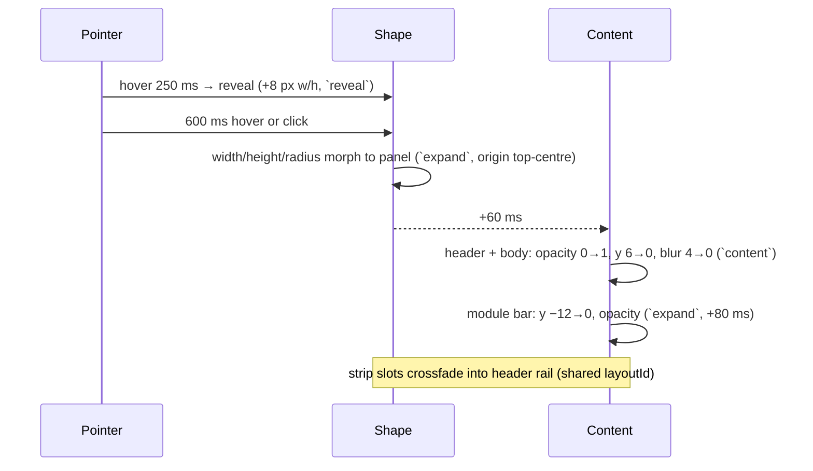

# 06 · Motion spec

Motion is how the notch communicates. A hardware notch cannot move; ours does, so every
movement must feel like one physical object stretching, not like a web page transitioning.

Implementation: [Motion](https://motion.dev) (`motion/react`) with spring transitions only, via
presets in `packages/ui/src/motion/presets.ts`. **Module code never writes `duration`,
`ease`, `stiffness` or `damping` literals.**

## Principles

1. **Springs, not durations.** Every shape or position change is a spring. Springs are
   frame-rate independent (60/120/144 Hz all look right) and interruptible mid-flight.
2. **Morph, don't fade.** The strip *becomes* the panel (one node whose size springs to
   the new bounds); content inside crossfades and rises a few pixels. Nothing pops in from
   nowhere.
3. **Shape leads, content follows.** The silhouette starts moving first; content appears
   ~60 ms later and disappears first on the way back. The eye tracks one thing at a time.
4. **Respond in 100 ms, settle in 500 ms.** First frame of feedback within 100 ms of input;
   most transitions visually complete within 300–450 ms; springs settle fully under 600 ms.
5. **Bounce is information.** A small overshoot says "something arrived" (notice, track
   change). Collapses, dismissals and HUD value changes have no bounce.
6. **Idle means idle.** A collapsed notch with no live activity animates nothing — not even a
   waveform. Every animation stops when its surface is hidden.
7. **Interruptible everywhere.** Hovering out mid-expand reverses from the current position
   with its velocity intact — which is why presets are physics springs (see below). No
   animation locks input.

## Spring presets

Presets are defined as **physics springs** (`stiffness / damping / mass`) because Motion's
physics springs inherit velocity when retargeted — a hover-out mid-expand reverses smoothly —
whereas its time-based `{ duration, bounce }` springs deliberately ignore inherited velocity.
The Apple columns are exact conversions for reviewers who think in SwiftUI:
`response = 2π·√(mass / stiffness)`, `ζ = damping / (2·√(stiffness·mass))`, and Motion's
Apple-style shorthand is `{ visualDuration: response / 1.2, bounce: 1 − ζ }`.

| Preset | stiffness / damping / mass | response / ζ | SwiftUI equivalent | Use | Source |
|--------|---------------------------|--------------|--------------------|-----|--------|
| `expand` | 224 / 24 / 1 | 0.42 / 0.80 | `.spring(response: .42, dampingFraction: .8)` | Strip → panel, strip → wide form, drop-tile row | boring.notch open |
| `collapse` | 224 / 30 / 1 | 0.42 / 1.00 | `.smooth(duration: .42)` | Panel → strip, wide → strip, dismiss (same spring as `expand`, critically damped) | boring.notch close (.45/1.0), DynamicNotchKit `.smooth(.4)` |
| `reveal` | 300 / 28 / 0.8 | 0.32 / 0.90 | `.snappy(duration: .3)` | Hover reveal (+16 w, +4 h), peek ↔ strip | PILLAR `snappy` |
| `notice` | 700 / 38 / 1.05 | 0.24 / 0.70 | `.bouncy(duration: .3)` | Live activity arriving, BT connect, charging, drop confirmation pulse | Ecosystem_WebUI island toast |
| `content` | 540 / 36 / 0.65 | 0.22 / 0.96 | `.spring(response: .22, dampingFraction: .96)` | Content enter (opacity, scale, y, blur) | Ecosystem_WebUI content |
| `switch` | 322 / 30 / 1 | 0.35 / 0.84 | `.snappy(duration: .35)` | Module switch height, segmented indicator, module-bar pill | derived from boring.notch content `.smooth(.35)` |
| `toggle` | 500 / 30 / 1 | 0.28 / 0.67 | `.bouncy(duration: .3)` | Toggles, chip select, tile hover grow, snap zones appear | recommendation from design research |
| `drag` | 273 / 26.5 / 1 | 0.38 / 0.80 | `.interactiveSpring(response: .38, dampingFraction: .8)` | Drag-driven shell size/position (shelf drag, zone follow) | boring.notch interactive |
| `interactive` | 1755 / 72 / 1 | 0.15 / 0.86 | `.interactiveSpring()` | Slider thumb/fill following pointer, ring value updates, waveform bars | Apple default |
| `press` | 1755 / 84 / 1 | 0.15 / 1.00 | `.interactiveSpring(response: .15, dampingFraction: 1)` | Button scale 1 → 0.96 → 1 | derived |
| `layout` | 224 / 28 / 1 | 0.42 / 0.94 | `.spring(response: .42, dampingFraction: .94)` | Reorder in module bar / dashboard, list insert/remove | derived |
| `hide` | 320 / 30 / 1 | 0.35 / 0.84 | `.spring(response: .35, dampingFraction: .84)` | Slide up and out before parking (fullscreen, monitor change) | PILLAR `slideAway` |

Reference points: Apple's `.spring()` default is response 0.5 / ζ 0.825 (158 / 20.7);
`.smooth` = bounce 0, `.snappy` = bounce 0.15, `.bouncy` = bounce 0.3, default duration 0.5.
Pure-CSS hover states may use `spring(stiffness, damping, mass).toString()` → `linear()`
easing (Chromium ≥ 113) exported from the same preset module.

Tuning happens only in the Storybook "Motion" playground and lands as a change to this table.

## Timings (non-spring)

| Event | Value |
|-------|-------|
| Hover intent before reveal | 250 ms; ignored if cursor velocity > 800 px/s (boring.notch: 300 ms) |
| Reveal → expand | 600 ms continuous hover, or click/scroll immediately |
| Hover-out grace | 150 ms from reveal, 300 ms from expanded; 30 px extended hover padding around the shape (boring.notch: 100 ms / 30 px) |
| Click outside / Esc | Collapse immediately |
| Content delay after shape starts | 60 ms (enter); content exits first in 80 ms, shape follows 40 ms later |
| Wide form on track change | 2.5 s hold, then `collapse` (boring.notch sneak-peek: 3 s) |
| HUD linger after last change | 1.5 s |
| Notice default hold | 4 s (priority table in [live-activities](modules/live-activities.md)) |
| Tie rotation between activities | 8 s, `switch` crossfade |
| Park/unpark debounce | 500 ms (fullscreen flapping never flickers) |
| Stagger (tiles, list, widgets) | 30 ms per item, max 8 items animating concurrently, `expand`/`layout` |
| Marquee | starts after 1.5 s, 40 px/s linear, 1.5 s end pause, only if overflow |
| Progress bars (media, pomodoro) | 1 s linear steps, interpolated with `interactive` on seek |
| Waveform | 30 Hz sample, per-bar `interactive`; amplitude 4–20 px; frozen when paused |
| Skeleton shimmer | 1.6 s linear loop, opacity 0.06 → 0.12; never on the strip |

## Content transition recipe

Every piece of content that appears inside the shell uses the same enter/exit:

- **Enter** (`content`): `opacity 0 → 1`, `scale 0.9 → 1` with `transform-origin: top center`,
  `y −6 → 0`, `filter: blur(5px) → 0` — the Dynamic Island "condense into place" look
  (DynamicNotchKit uses blur 10 + scaleY 0.6 anchored top; boring.notch scale 0.8 + opacity).
- **Exit**: `opacity → 0`, `scale → 0.96`, **no blur**, 80 ms ease-out — content must be gone
  before the shell clips it. `AnimatePresence mode="popLayout"` so exits don't push layout.
- Blur is applied only to nodes ≤ 320 × 160 px; larger bodies enter with opacity + scale only.

## Choreography

### Strip → panel (expand)

- The strip's two slots keep their `layoutId` so album art glides into the panel's art tile
  and the HUD glyph becomes the header icon.
- **The shell is one node whose real `width`/`height` are animated** (targets come from a
  hidden measurement node via `ResizeObserver`), not a FLIP `layout` scale — layout-scaling
  distorts text and borders mid-morph. Children that must move use `layout="position"`.
- The bottom corners keep radius 14 → 28 by animating `borderRadius` on the same node
  (radii are interpolated by Motion). In Island shape the constant 32 px radius needs no
  animation at all: it clamps to a capsule when collapsed and reads as 32 px when expanded.
- Squircle corners (`corner-shape: squircle` or the `clip-path: path()` fallback, see
  [design system](05-design-system.md#shape)) are **never animated per frame**: the morph
  runs with plain `border-radius` and the squircle mask is swapped in at rest (`onComplete`).
- Content inside the panel is clipped by the shape (`overflow: clip`); it never spills.

### Panel → strip (collapse)

Content exits first (80 ms opacity + scale 0.96, no blur), the shape follows 40 ms later with
`collapse`; the module bar drops 8 px and fades simultaneously. Whatever live activity is due
appears 150 ms after the shape settles (`notice`).

### Live activity (notice)

The strip widens with `notice` and the leading/trailing slot content slides *out from behind
the black centre* (translateX from ±24 px, masked by the shape) — the Dynamic Island "content
emerges from the hardware" trick. Dismissal is `collapse` with content sliding back behind the
centre. Two simultaneous activities share the two slots; a third queues.

**Split Island (P3, Island shape only).** When a second activity arrives, the Island may
split into a main pill plus a detached 36 px circle to its right (iOS 17 behaviour). The
"gooey" merge/split uses an SVG filter (`feGaussianBlur stdDeviation 6` → `feColorMatrix`
alpha `22 −10`) applied to a tiny wrapper **only for the ~300 ms of the transition**, then
removed — filters on a persistent node cost a full-surface repaint every frame.

### HUD

Glyph swaps with a 100 ms crossfade; track appears with `reveal`; fill follows the value with
`interactive`; on mute the fill drains with `collapse` and the glyph gets a slash via path
morph (Lucide `volume-x`). Repeated key presses never restart the appear animation.

### Module switch

Old body exits (80 ms), height springs to the new size (`switch`), new body enters
(`content`, +40 ms). The module-bar indicator pill glides with `switch` (shared `layoutId`).
Icons in the bar scale 1 → 1.08 → 1 on hover with `toggle`.

### Drop actions

On drag-enter the strip morphs into the tile row with `expand`; tiles stagger 30 ms with
y 8→0 + scale 0.94→1. Hovering a tile grows it 1.04 (`toggle`) and tints `--surface-3`; the
target tile pulses once (scale 1.06 → 1, `notice`) on drop, then the row collapses.
Reference: NotchDrop opens with `.spring(response: .5, dampingFraction: .8)`.

### Window snap

Zones fade in with `toggle` (opacity + scale 0.98→1) 120 ms after a drag starts near the
notch; the hovered zone fills `--surface-3`; the target window's move uses `SetWindowPos` in
Rust and our zone overlay collapses with `collapse`.

### Press, hover, focus

Buttons: scale 0.96 on `pointerdown` (`press`), back on `pointerup`; hover tints only. Rows:
background crossfade 120 ms. Toggles: knob `toggle`, track colour 150 ms. Focus ring appears
instantly (no animation).

### Rings & numbers

Ring values animate with `interactive` on change; on first appearance they draw from 0 with
`expand` (max 900 ms perceived for large values). Big numbers use a digit roll only for
countdowns (Pomodoro), otherwise crossfade — never for percentages that change every second.

## Reduced motion

`prefers-reduced-motion: reduce` **or** Settings → Appearance → Reduce motion:

- All springs become `duration: 0.15, ease: [0.2, 0, 0, 1]` (ease-out), no bounce, no scale.
- Shape changes still happen (they're information) but content crossfades only (no rise/blur).
- Marquee off (truncate), waveform frozen bars, shimmer off, stagger 0, ring draw-in off.
- Wide form and notices still appear; hold times +50 %.

`useMotionPreset(name)` returns the correct transition; `MotionConfig reducedMotion="user"`
is set at the root, and the app setting overrides via context.

## Performance rules

- Animate `transform`, `opacity`, `border-radius` and `filter` (small elements only). The
  **shell node is the one sanctioned exception**: its `width`/`height` are animated directly
  because a FLIP scale would distort its text. Everything else uses transforms or Motion
  `layout="position"`. **Never** animate `top/left/box-shadow/background-position`.
- `will-change` is added by Motion during animation only; do not add it statically.
- The notch root has `contain: layout paint style` and `overflow: clip`; large blurs are
  forbidden; `filter: blur()` only on elements ≤ 320 × 160 px and ≤ 6 px radius.
- `AnimatePresence mode="popLayout"` for lists; `LayoutGroup` per surface to avoid cross-surface
  layout calculations.
- Frame budget 16.6 ms at 60 Hz (target 8 ms of main-thread work); the fps overlay
  (`MUNA_FPS=1`) must show ≥ 58 fps during expand/collapse on a 4K 150 % monitor.
- Springs settle: Motion stops when `restDelta`/`restSpeed` are reached; never leave infinite
  `repeat` animations mounted while collapsed (waveform/shimmer unmount on hide).
- Pointer-following (`interactive`) uses `useMotionValue` + `useSpring`, not React state.
- Images (album art) are pre-decoded (`decoding="async"`, `createImageBitmap`) before the
  morph starts; the morph never waits on network.
- The window is sized to the maximum bounds plus 20 px shadow padding and ~8 % overshoot
  headroom so springs never clip against the window edge.

## Sound

Muna is **silent by default**. Optional, individually toggled sounds (Settings → Sounds):
Pomodoro completion chime, drop confirmation, connect/disconnect. Assets must be CC0 (Kenney
Interface Sounds or self-recorded); never Apple system sounds. Sounds play via the Web Audio
API at −12 dBFS peak and are suppressed while the system is in focus-assist / presentation
mode.

## Review checklist (used by `muna-design-reviewer`)

- [ ] Only presets used; no literal easings/durations
- [ ] Shape leads, content follows; exits before enters
- [ ] Bounce only on arrivals; none on collapse/dismiss/HUD
- [ ] Interruptible (hover out mid-expand reverses cleanly — physics presets, never
      `{ duration, bounce }` for the shell)
- [ ] Shell morph animates the real node size; no text distortion mid-morph
- [ ] Squircle mask swapped in only at rest
- [ ] Reduced-motion path verified in Storybook
- [ ] Nothing animates while collapsed and idle
- [ ] fps overlay ≥ 58 during morph on a 150 % display; no layout thrash in DevTools performance trace

## References

- Apple Human Interface Guidelines — Live Activities (Dynamic Island behaviour):
  https://developer.apple.com/design/human-interface-guidelines/live-activities
- Apple `Spring` API (`duration`/`bounce`, `smooth`/`snappy`/`bouncy`):
  https://developer.apple.com/documentation/swiftui/spring
- Motion transitions (`visualDuration`, `bounce`, `layout`): https://motion.dev/docs/react-transitions
- Motion layout animations: https://motion.dev/docs/react-layout-animations
- Motion `spring()` → CSS `linear()` generator: https://motion.dev/docs/spring
- Reference implementations whose spring values were measured for the preset table:
  [boring.notch](https://github.com/TheBoredTeam/boring.notch) (open/close/interactive springs,
  hover timings, notch path), [NotchDrop](https://github.com/Lakr233/NotchDrop) (drop
  animation), [DynamicNotchKit](https://github.com/MrKai77/DynamicNotchKit) (content
  blur/scale transition), [PILLAR](https://github.com/warpirate/pillar-dynamic-island-for-windows)
  (Windows spring presets, fullscreen heuristic),
  [Ecosystem_WebUI](https://github.com/UselessToys/Ecosystem_WebUI) (web island toast physics),
  [spectrum-ui](https://github.com/arihantcodes/spectrum-ui) (React Dynamic Island component).
