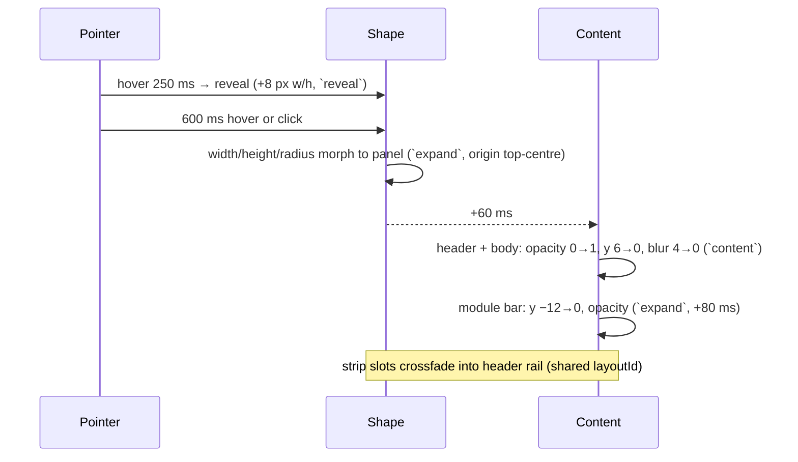

# 06 · Motion spec

Motion is how the notch communicates. A hardware notch cannot move; ours does, so every
movement must feel like one physical object stretching, not like a web page transitioning.

Implementation: [Motion](https://motion.dev) (`motion/react`) with spring transitions only, via
presets in `packages/ui/src/motion/presets.ts`. **Module code never writes `duration`,
`ease`, `stiffness` or `damping` literals.**

## Principles

1. **Springs, not durations.** Every shape or position change is a spring. Springs are
   frame-rate independent (60/120/144 Hz all look right) and interruptible mid-flight.
2. **Morph, don't fade.** The strip *becomes* the panel (shared layout); content inside
   crossfades and rises a few pixels. Nothing pops in from nowhere.
3. **Shape leads, content follows.** The silhouette starts moving first; content appears
   ~60 ms later and disappears first on the way back. The eye tracks one thing at a time.
4. **Respond in 100 ms, settle in 500 ms.** First frame of feedback within 100 ms of input;
   most transitions visually complete within 300–450 ms; springs settle fully under 600 ms.
5. **Bounce is information.** A small overshoot says "something arrived" (notice, track
   change). Collapses, dismissals and HUD value changes have no bounce.
6. **Idle means idle.** A collapsed notch with no live activity animates nothing — not even a
   waveform. Every animation stops when its surface is hidden.
7. **Interruptible everywhere.** Hovering out mid-expand reverses from the current position.
   No animation locks input.

## Spring presets

Motion's `visualDuration` + `bounce` map directly onto Apple's `Spring(duration:bounce:)`
(bounce 0 = critically damped; `dampingFraction ≈ 1 − bounce`). Stiffness/damping columns are
the equivalents for mass 1 (`stiffness = (2π / response)²`, `damping = 4π · ζ / response`), for
non-Motion consumers (Rust native pill, CSS `linear()` fallbacks).

| Preset | visualDuration | bounce | ≈ response / ζ | stiffness / damping | Use |
|--------|----------------|--------|----------------|---------------------|-----|
| `expand` | 0.42 s | 0.18 | 0.45 / 0.82 | 195 / 23 | Strip → panel, strip → wide form, drop tiles |
| `collapse` | 0.30 s | 0.02 | 0.32 / 0.98 | 386 / 38 | Panel → strip, wide → strip, dismiss |
| `reveal` | 0.24 s | 0.10 | 0.26 / 0.90 | 584 / 43 | Hover reveal (strip grows 8 px), peek ↔ strip |
| `notice` | 0.48 s | 0.26 | 0.50 / 0.74 | 158 / 19 | Live activity arriving, BT connect, charging |
| `content` | 0.28 s | 0.00 | 0.30 / 1.00 | 439 / 42 | Content crossfade + rise (opacity, y, blur) |
| `switch` | 0.36 s | 0.08 | 0.38 / 0.92 | 273 / 30 | Module switch, segmented control indicator, tab pill |
| `interactive` | 0.16 s | 0.00 | 0.15 / 0.86 | 1755 / 72 | Slider thumb/fill following pointer, drag follow, ring value updates |
| `press` | 0.14 s | 0.00 | 0.15 / 1.00 | 1755 / 84 | Button scale 1 → 0.96 → 1 |
| `snap` | 0.34 s | 0.12 | 0.36 / 0.88 | 305 / 31 | Snap zones appear, tile hover grow, chip select |
| `layout` | 0.40 s | 0.06 | 0.42 / 0.94 | 224 / 28 | Reorder in module bar / dashboard, list insert/remove |

Named SwiftUI anchors for reviewers: `expand` ≈ `.spring(duration: 0.45, bounce: 0.2)`,
`collapse` ≈ `.smooth(duration: 0.3)`, `notice` ≈ `.bouncy`, `interactive` ≈
`.interactiveSpring()`, `switch` ≈ `.snappy(duration: 0.35)`.

Tuning happens only in the Storybook "Motion" playground and lands as a change to this table.

## Timings (non-spring)

| Event | Value |
|-------|-------|
| Hover intent before reveal | 250 ms; ignored if cursor velocity > 800 px/s |
| Reveal → expand | 600 ms continuous hover, or click/scroll immediately |
| Auto-collapse after pointer leaves | 800 ms (0 when Esc) |
| Content delay after shape starts | 60 ms (enter); content exits 0 ms, shape follows 40 ms later |
| Wide form on track change | 2.5 s hold, then `collapse` |
| HUD linger after last change | 1.5 s |
| Notice default hold | 4 s (priority table in [live-activities](modules/live-activities.md)) |
| Tie rotation between activities | 8 s, `switch` crossfade |
| Stagger (tiles, list, widgets) | 30 ms per item, max 8 items staggered, `expand`/`layout` |
| Marquee | starts after 1.5 s, 40 px/s linear, 1.5 s end pause, only if overflow |
| Progress bars (media, pomodoro) | 1 s linear steps, interpolated with `interactive` on seek |
| Waveform | 30 Hz sample, per-bar `interactive`; amplitude 4–20 px; frozen when paused |
| Skeleton shimmer | 1.6 s linear loop, opacity 0.06 → 0.12; never on the strip |

## Choreography

### Strip → panel (expand)

- The strip's two slots keep their `layoutId` so album art glides into the panel's art tile
  and the HUD glyph becomes the header icon.
- The bottom corners keep radius 14 → 28 via `layout` (radius interpolated by Motion).
- Content inside the panel is clipped by the shape (`overflow: clip`); it never spills.

### Panel → strip (collapse)

Content exits first (`content`, opacity 1→0, y 0→4, 120 ms perceived), the shape follows
40 ms later with `collapse`; the module bar drops 8 px and fades simultaneously. Whatever
live activity is due appears 150 ms after the shape settles (`notice`).

### Live activity (notice)

The strip widens with `notice` and the leading/trailing slot content slides *out from behind
the black centre* (translateX from ±24 px, masked by the shape) — the Dynamic Island "content
emerges from the hardware" trick. Dismissal is `collapse` with content sliding back behind the
centre. Two simultaneous activities share the two slots; a third queues.

### HUD

Glyph swaps with a 100 ms crossfade; track appears with `reveal`; fill follows the value with
`interactive`; on mute the fill drains with `collapse` and the glyph gets a slash via path
morph (Lucide `volume-x`). Repeated key presses never restart the appear animation.

### Module switch

Old body exits (`content`), height springs to the new size (`switch`), new body enters
(`content`, +40 ms). The module-bar indicator pill glides with `switch` (shared `layoutId`).
Icons in the bar scale 1 → 1.08 → 1 on hover with `snap`.

### Drop actions

On drag-enter the strip morphs into the tile row with `expand`; tiles stagger 30 ms with
y 8→0 + scale 0.94→1. Hovering a tile grows it 1.04 (`snap`) and tints `--surface-3`; the
target tile pulses once (scale 1.06 → 1, `notice`) on drop, then the row collapses.

### Window snap

Zones fade in with `snap` (opacity + scale 0.98→1) 120 ms after a drag starts near the notch;
the hovered zone fills `--surface-3`; the target window's move uses `SetWindowPos` in Rust and
our zone overlay collapses with `collapse`.

### Press, hover, focus

Buttons: scale 0.96 on `pointerdown` (`press`), back on `pointerup`; hover tints only. Rows:
background crossfade 120 ms. Toggles: knob `switch`, track colour 150 ms. Focus ring appears
instantly (no animation).

### Rings & numbers

Ring values animate with `interactive` on change; on first appearance they draw from 0 with
`expand` (max 900 ms perceived for large values). Big numbers use a digit roll only for
countdowns (Pomodoro), otherwise crossfade — never for percentages that change every second.

## Reduced motion

`prefers-reduced-motion: reduce` **or** Settings → Appearance → Reduce motion:

- All springs become `duration: 0.15, ease: [0.2, 0, 0, 1]` (ease-out), no bounce, no scale.
- Shape changes still happen (they're information) but content crossfades only (no rise/blur).
- Marquee off (truncate), waveform frozen bars, shimmer off, stagger 0, ring draw-in off.
- Wide form and notices still appear; hold times +50 %.

`useMotionPreset(name)` returns the correct transition; `MotionConfig reducedMotion="user"`
is set at the root, and the app setting overrides via context.

## Performance rules

- Animate `transform`, `opacity`, `clip-path`/`border-radius` (via `layout`) and `filter`
  (small elements only). **Never** animate `width/height/top/left/box-shadow/background-position`
  directly — use Motion `layout` (FLIP) or transforms.
- `will-change` is added by Motion during animation only; do not add it statically.
- The notch root has `contain: layout paint style` and `overflow: clip`; large blurs are
  forbidden; `filter: blur()` only ≤ 64 px elements and ≤ 6 px radius.
- `AnimatePresence mode="popLayout"` for lists; `LayoutGroup` per surface to avoid cross-surface
  layout calculations.
- Frame budget 16.6 ms at 60 Hz (target 8 ms of main-thread work); the fps overlay
  (`MUNA_FPS=1`) must show ≥ 58 fps during expand/collapse on a 4K 150 % monitor.
- Springs settle: Motion stops when `restDelta`/`restSpeed` are reached; never leave infinite
  `repeat` animations mounted while collapsed (waveform/shimmer unmount on hide).
- Pointer-following (`interactive`) uses `useMotionValue` + `useSpring`, not React state.
- Images (album art) are pre-decoded (`decoding="async"`, `createImageBitmap`) before the
  morph starts; the morph never waits on network.

## Sound & haptics

None. Muna is silent by default; the Pomodoro completion chime is the only optional sound.

## Review checklist (used by `muna-design-reviewer`)

- [ ] Only presets used; no literal easings/durations
- [ ] Shape leads, content follows; exits before enters
- [ ] Bounce only on arrivals; none on collapse/dismiss/HUD
- [ ] Interruptible (hover out mid-expand reverses cleanly)
- [ ] Reduced-motion path verified in Storybook
- [ ] Nothing animates while collapsed and idle
- [ ] fps overlay ≥ 58 during morph on a 150 % display; no layout thrash in DevTools performance trace

## References

- Apple Human Interface Guidelines — Live Activities (Dynamic Island behaviour):
  https://developer.apple.com/design/human-interface-guidelines/live-activities
- Apple `Spring` API (`duration`/`bounce`, `smooth`/`snappy`/`bouncy`):
  https://developer.apple.com/documentation/swiftui/spring
- Motion transitions (`visualDuration`, `bounce`, `layout`): https://motion.dev/docs/react-transitions
- Motion layout animations: https://motion.dev/docs/react-layout-animations
