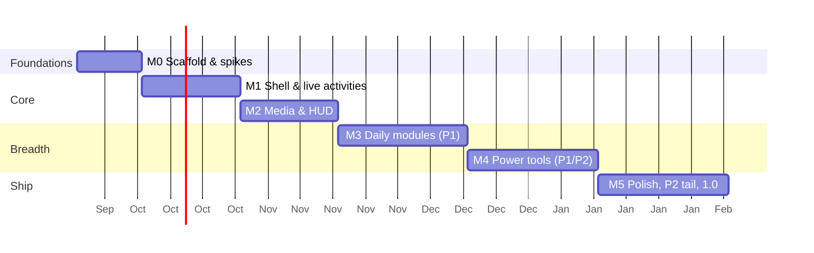

# 07 · Roadmap

Six milestones from empty repo to 1.0. Each milestone has **exit criteria** that must be
demonstrated (recording + numbers) before the next one starts. Epics map 1:1 to kickoff
prompts in [`build-plan/`](build-plan/README.md) and to `module` issues.

Tiers come from the [feature catalog](02-feature-catalog.md). Budgets come from the
[PRD](01-product-vision.md#performance--quality-budgets-enforced-in-ci-where-possible).

Durations are planning estimates for one lead + agents; parallelism between epics inside a
milestone is expected.

---

## M0 · Foundations & spikes (2 weeks)

**Goal:** a repo where every later task has a place to land, and the two biggest technical
risks are measured.

Epics

- **M0-E1 Monorepo scaffold** — pnpm workspace, `apps/desktop` (Tauri v2 + React 19 + TS
  strict + Tailwind v4 + Motion), `packages/ui` (tokens, primitives, Storybook), `packages/contracts`
  (tauri-specta generated types + zod), `packages/i18n`, `apps/site` placeholder. ESLint/Prettier/
  Clippy/rustfmt, Vitest, Playwright, CI green on `windows-latest`.
- **M0-E2 Transparent-window spike** — one notch window per monitor with ADR-0002 rules;
  measure flash-free start, 100 collapse/expand cycles, monitor hot-plug, DPI change, Win10 + Win11.
  Decide: WebView pill vs native pill escape hatch.
- **M0-E3 Identity spike** — MSIX via `MakeAppx` + external-location manifest for NSIS;
  verify `NotificationChanged` fires; verify `StartupTask`; sign with a test cert. Verify
  Azure Artifact Signing / SignPath eligibility.
- **M0-E4 Design tokens & motion presets** — `packages/ui/tokens.css`, spring presets in
  `motion/presets.ts`, Storybook "Foundations" pages, reduced-motion switch.

Exit criteria

- [ ] `pnpm -w lint typecheck test` and `cargo clippy -D warnings` pass in CI.
- [ ] Spike app shows a black strip on 2 monitors (mixed DPI) with zero flashes over 100 cycles;
  idle CPU ≤ 0.3 %, RSS ≤ 120 MB (numbers in `docs/spikes/m0-window.md`).
- [ ] Identity spike report with pass/fail per API (`docs/spikes/m0-identity.md`).
- [ ] ADR-0001/0002/0003 updated to *Accepted (validated)* or amended.

## M1 · Shell & live activities (3 weeks)

**Goal:** the notch exists, feels Apple-grade, and shows real system state.

Epics

- **M1-E1 Notch shell** — state machine ([notch-shell](modules/notch-shell.md)), Overlay and
  Reserved-strip modes, Notch/Island shapes, per-monitor placement, yield rules (caption overlap,
  fullscreen, drag), hit-testing, tray icon, single instance, autostart.
- **M1-E2 Live activities** — scheduler ([live-activities](modules/live-activities.md)),
  priorities, wide form, notices; sources: battery/charging, lock/unlock, Bluetooth connect
  (device name + battery), Pomodoro placeholder.
- **M1-E3 Settings window** — [settings](modules/settings.md): sidebar shell, General/Layout/
  Multiple screens/Notch positioning panes, schema + migrations, import/export, diagnostics
  export.
- **M1-E4 Module bar & panel chrome** — panel container, header, icon rail, module bar
  pill with reorder, keyboard navigation, Esc/pin behaviour.
- **M1-E5 Onboarding** — first-run: pick monitor, mode, shape; permissions explainer.

Exit criteria

- [ ] Hover → expand → collapse morph at ≥ 58 fps on a 4K 150 % display; recording attached.
- [ ] Notch yields correctly in 10 scripted scenarios (`docs/qa/checklists/notch-shell.md`).
- [ ] Battery/charging and Bluetooth live activities demonstrated on a laptop.
- [ ] Settings persist across restart; import/export round-trip test passes.

## M2 · Media & HUD (3 weeks)

**Goal:** the two features users see 100× a day are flawless.

Epics

- **M2-E1 Media backend** — SMTC sessions with scoring + WASAPI verification, thumbnails,
  timeline interpolation, controls, palette extraction, staleness watchdog.
- **M2-E2 Media UI** — strip (art + waveform), wide form on track change, panel (art, meta,
  progress, transport, volume, device picker, visualizer), lyrics (LRCLIB) optional.
- **M2-E3 HUD** — volume/brightness/mute HUD in the strip, native flyout suppression with
  watchdog, DDC/CI probe, scroll-to-volume.
- **M2-E4 Perf harness** — `scripts/perf` CPU/RSS/fps measurement in nightly CI.

Exit criteria

- [ ] Spotify, Edge/YouTube, Apple Music (Store), foobar2000 all show correct now-playing
  within 300 ms of change; wrong-session rate 0 in a 30-switch script.
- [ ] Idle CPU with media playing and strip visible ≤ 1 %; visualizer off when not visible.
- [ ] HUD replaces native flyout on Win11 24H2 and Win10 22H2; native restored after kill -9.

## M3 · Daily modules (4 weeks)

**Goal:** the P1 set people plan their day with.

Epics: **M3-E1 Calendar** (Graph + Google + ICS, meeting-join live activity), **M3-E2 To-do**,
**M3-E3 Pomodoro** (+ live activity), **M3-E4 Weather**, **M3-E5 Notifications** (identity
path + polling fallback, grouping, actions), **M3-E6 Day progress**, **M3-E7 Bluetooth panel**
(connect/disconnect, battery), **M3-E8 System monitor** (CPU/RAM/GPU/net/disk, top processes),
**M3-E9 Dashboard** (widget grid composing the above).

Exit criteria

- [ ] Every module has: backend tests with fake platform, Storybook states, acceptance tests,
  settings pane, i18n keys, spec status *Implemented*.
- [ ] Dashboard renders all widgets at 60 fps while media plays; RSS ≤ 120 MB with all P1 on.
- [ ] Notifications module works in MSIX (events) and NSIS (polling) builds.

## M4 · Power tools (4 weeks)

**Goal:** the features that make Muna a hub, not a widget.

Epics: **M4-E1 Drop actions** (tiles, IFileOperation, compress, share, eject), **M4-E2 Shelf**
(persist, drag-out, clipboard), **M4-E3 Window snap** (zones, drag tracking, layouts),
**M4-E4 Code hosting** (GitHub device flow, GitLab, PR/checks/notifications), **M4-E5 AI
coding status** (Claude Code / Codex / Copilot CLI adapters), **M4-E6 Keyboard shortcuts**
(global hotkeys, palette), **M4-E7 Notes**, **M4-E8 Screen time**.

Exit criteria

- [ ] Drop → tile → action round-trips on Explorer, browsers, Outlook attachments.
- [ ] Shelf drag-out lands files in Explorer, Chrome upload, Teams.
- [ ] Snap positions correct on mixed-DPI monitors within 1 px (frame-bounds compensated).
- [ ] GitHub rate-limit friendly (ETag/poll-interval respected) in a 24 h soak.

## M5 · Polish, P2 tail & 1.0 (4 weeks)

Epics: **M5-E1 P2 modules** (Health, Translation, Mirror, Support), **M5-E2 Fidelity pass**
(design-reviewer audit of every surface vs reference screenshots; motion audit), **M5-E3
Accessibility** (screen reader names, keyboard, high contrast, reduced motion), **M5-E4 Release
engineering** (signed MSIX + NSIS, updater channel, release notes, Store readiness), **M5-E5
Landing site** (`apps/site`, downloads, docs), **M5-E6 Localization** (5 launch locales).

Exit criteria

- [ ] Zero *blocking* design-review findings; all budgets green in nightly perf for 14 days.
- [ ] Crash-free 7-day soak on 3 machines (Win10 laptop, Win11 desktop 3 monitors, Win11 tablet).
- [ ] Signed installers published from CI with release notes; update from previous build works.

---

## Post-1.0 candidates

Plugin API (third-party modules), Composition host-backdrop blur for Island shape, Spotify
Web API enrichment, Home/IoT tiles, Focus modes with app blocking, cross-device Nearby Share
receive, Store listing.

## Status tracking

| Milestone | Status | Started | Done | Notes |
|-----------|--------|---------|------|-------|
| M0 | Not started | | | |
| M1 | Not started | | | |
| M2 | Not started | | | |
| M3 | Not started | | | |
| M4 | Not started | | | |
| M5 | Not started | | | |

Update this table (and module spec statuses) when a milestone closes.
