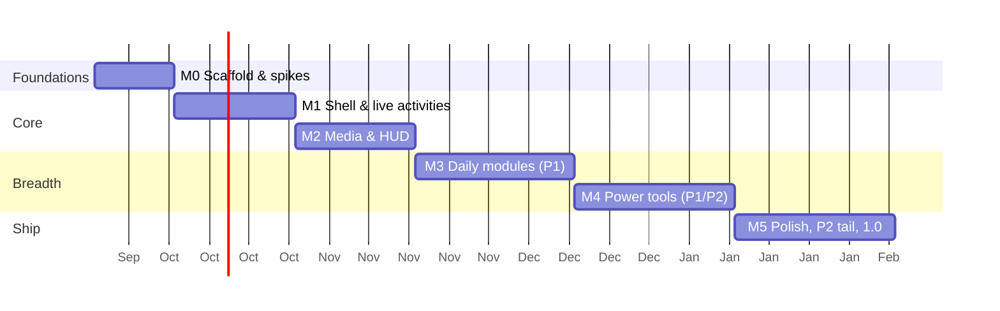

# 07 · Roadmap

Six milestones from empty repo to 1.0. Each milestone has **exit criteria** that must be
demonstrated (recording + numbers) before the next one starts. Epics map 1:1 to kickoff
prompts in [`build-plan/`](build-plan/README.md) and to `module` issues.

Tiers come from the [feature catalog](02-feature-catalog.md). Budgets come from the
[PRD](01-product-vision.md#performance--quality-budgets-enforced-in-ci-where-possible).

Durations are planning estimates for one lead + agents; parallelism between epics inside a
milestone is expected.

---

## M0 · Foundations & spikes (2 weeks)

**Goal:** a repo where every later task has a place to land, and the two biggest technical
risks are measured.

Epics

- **M0-E1 Monorepo scaffold** — pnpm workspace, `apps/desktop` (Tauri v2 + React 19 + TS
  strict + Tailwind v4 + Motion), `packages/ui` (tokens, primitives, Storybook), `packages/contracts`
  (tauri-specta generated types + zod), `packages/i18n`, `apps/site` placeholder. ESLint/Prettier/
  Clippy/rustfmt, Vitest, Playwright, CI green on `windows-latest`.
- **M0-E2 Transparent-window spike** — one notch window per monitor with ADR-0002 rules;
  measure flash-free start, 100 collapse/expand cycles, monitor hot-plug, DPI change, Win10 + Win11.
  Decide: WebView pill vs native pill escape hatch.
- **M0-E3 Identity spike** — MSIX via `MakeAppx` + external-location manifest for NSIS;
  verify `NotificationChanged` fires; verify `StartupTask`; sign with a test cert. Verify
  Azure Artifact Signing / SignPath eligibility.
- **M0-E4 Design tokens & motion presets** — `packages/ui/src/tokens/tokens.css`, spring
  presets in `motion/presets.ts`, Storybook "Foundations" pages, reduced-motion switch.

Exit criteria

- [x] All required checks in `ci.yml` (`web`, `rust`, `deps`, `app`) run and pass on
  `windows-latest`/`ubuntu-latest`; root parity scripts from [11](11-ci-cd.md#local-parity) exist
  (M0-E1, [PR #3](https://github.com/miklol/Muna/pull/3)).
- [ ] `main` ruleset, `v*` tag ruleset, `release` environment and Dependabot configured per
  [11](11-ci-cd.md#protection-rules) (maintainer task; checklist delivered by M0-E3). Partly
  done and partly plan-blocked: Dependabot alerts + security updates, squash-only merges and
  read-only Actions permissions are on; rulesets and the protected `release` environment need
  GitHub Pro or a public repository — see the ticks in
  [11 › bootstrap checklist](11-ci-cd.md#bootstrap-checklist-maintainer-once).
- [x] `release.yml` dry run produces unsigned NSIS + MSIX artifacts
  ([run 34972995225](https://github.com/miklol/Muna/actions/runs/34972995225) from `main` @
  `57e8dcd`: NSIS setup 2.73 MB, MSIX 3.36 MB, external-location MSIX 8.7 KB, App Installer
  file, cargo + npm SBOMs; I9 row in `docs/spikes/m0-identity.md`).
- [x] Spike app shows a black strip on 2 monitors (mixed DPI) with zero flashes over 100 cycles;
  idle CPU ≤ 0.3 %, RSS ≤ 120 MB (numbers in `docs/spikes/m0-window.md`; Win11 25H2 — the
  Win10 22H2 column is a maintainer runbook). RSS passes only with the WebView2 switch set
  recorded in ADR-0002 (`--in-process-gpu`, one shared renderer); the default process model
  measured 181–223 MB — decision and guard in the spike's recommendation and risk R19.
- [x] Identity spike report with pass/fail per API (`docs/spikes/m0-identity.md`; Win11 25H2 —
  I1–I10 pass on both identity routes, `NotificationChanged` 8–10 ms with identity, polling
  fallback validated unpackaged; I11 signing route is a maintainer decision).
- [x] ADR-0001/0002/0003 updated to *Accepted (validated)* or amended (0001/0002 validated by
  M0-E2, 0003 amended by M0-E3; ticked by the M0 closing PR).

## M1 · Shell & live activities (3 weeks)

**Goal:** the notch exists, feels Apple-grade, and shows real system state.

Epics

- **M1-E1 Notch shell** — state machine ([notch-shell](modules/notch-shell.md)), Overlay and
  Reserved-strip modes, Notch/Island shapes, per-monitor placement, yield rules (caption overlap,
  fullscreen, drag), hit-testing, tray icon, single instance, autostart.
- **M1-E2 Live activities** — scheduler ([live-activities](modules/live-activities.md)),
  priorities, wide form, notices; sources: battery/charging, lock/unlock, Bluetooth connect
  (device name + battery), Pomodoro placeholder.
- **M1-E3 Settings window** — [settings](modules/settings.md): sidebar shell, General/Layout/
  Multiple screens/Notch positioning panes, schema + migrations, import/export, diagnostics
  export.
- **M1-E4 Module bar & panel chrome** — panel container, header, icon rail, module bar
  pill with reorder, keyboard navigation, Esc/pin behaviour.
- **M1-E5 Onboarding** — first-run: pick monitor, mode, shape; permissions explainer.

Exit criteria

- [x] Hover → expand → collapse morph at ≥ 58 fps on a 4K 150 % display; recording attached.
  **Measured** on 2560 × 1600 at 150 % (165 Hz): expand 158–167 fps, collapse 157–167 fps,
  0 dropped frames ([notch-shell → Implementation
  notes](modules/notch-shell.md#implementation-notes-m1-e1)). The notch window is sized in CSS
  px × scale (1680 × 720 physical at 150 %), so the morph renders the same pixels on a 4K 150 %
  display; the recording on an actual 4K panel is a maintainer item.
- [x] Notch yields correctly in 10 scripted scenarios
  ([`docs/qa/checklists/notch-shell.md`](qa/checklists/notch-shell.md)): 10 / 10 pass on
  2026-09-16 with `scripts/qa/notch-yield.ps1` (Peek 30 ms after a foreground change, drag
  201 ms, park 510–893 ms with the 500 ms debounce, Reserved-strip work area exact).
- [ ] Battery/charging and Bluetooth live activities demonstrated on a laptop. The reducers and
  the Windows Bluetooth watcher are tested (`tests/live_activities.rs`, `platform-tests`); the
  laptop recording is a maintainer item — the development machine is a desktop.
- [x] Settings persist across restart; import/export round-trip test passes.
  `muna-core::settings` `defaults_round_trip_through_json` and `per_monitor_layouts_round_trip`
  exercise the same `to_json` / `from_json` pair that `export_settings` / `import_settings`
  use; the dev profile's Compact strip height and a Reserved-mode edit of `settings.json` were
  in effect after every restart of the checklist run.

## M2 · Media & HUD (3 weeks)

**Goal:** the two features users see 100× a day are flawless.

Epics

- **M2-E1 Media backend** — SMTC sessions with scoring + WASAPI verification, thumbnails,
  timeline interpolation, controls, palette extraction, staleness watchdog.
- **M2-E2 Media UI** — strip (art + waveform), wide form on track change, panel (art, meta,
  progress, transport, volume, device picker, visualizer), lyrics (LRCLIB) optional.
- **M2-E3 HUD** — volume/brightness/mute HUD in the strip, native flyout suppression with
  watchdog, DDC/CI probe, scroll-to-volume.
- **M2-E4 Perf harness** — `scripts/perf` CPU/RSS/fps measurement in nightly CI.

Exit criteria

- [ ] Spotify, Edge/YouTube, Apple Music (Store), foobar2000 all show correct now-playing
  within 300 ms of change; wrong-session rate 0 in a 30-switch script. **Measured** with
  Spotify on Win11 25H2 via `scripts/qa/media-latency.ps1`: play 19–23 ms, pause 275–292 ms
  (Spotify's own fade-out), track change 71–86 ms; 0 wrong picks in the 30-switch script,
  which also runs against the fake platform in `tests/media.rs`
  ([media → Implementation notes (M2-E1)](modules/media.md#implementation-notes-m2-e1)). The
  Edge/YouTube, Apple Music and foobar2000 columns wait for the maintainer's machines
  ([qa/checklists/media](qa/checklists/media.md)).
- [ ] Idle CPU with media playing and strip visible ≤ 1 %; visualizer off when not visible.
  Not measured yet: the harness's idle window runs with nothing playing (0.003–0.014 %
  normalised; [notch-shell → Memory target](modules/notch-shell.md#memory-target)), and the
  media-playing window waits for the bundled SMTC test player deferred from M2-E4. The
  spectrum visualiser itself waits for WASAPI (M2-E2 shipped the SMTC-driven waveform).
- [ ] HUD replaces native flyout on Win11 24H2 and Win10 22H2; native restored after kill -9.
  **Measured** on Win11 25H2 (26200): flyout hidden 5 ms after the call, re-asserted ≤ 50 ms
  after a foreign restore, restored 19–31 ms after a hard kill against the 2 s budget
  ([hud → Implementation notes (M2-E3 PR A)](modules/hud.md#implementation-notes-m2-e3-pr-a)).
  Win11 24H2 (rows 1 and 14 on that build) and the Win10 22H2 `NativeHWNDHost` flyout (row 15)
  wait for hardware ([qa/checklists/hud](qa/checklists/hud.md)).

## M3 · Daily modules (4 weeks)

**Goal:** the P1 set people plan their day with.

Epics: **M3-E1 Calendar** (Graph + Google + ICS, meeting-join live activity), **M3-E2 To-do**,
**M3-E3 Pomodoro** (+ live activity), **M3-E4 Weather**, **M3-E5 Notifications** (identity
path + polling fallback, grouping, actions), **M3-E6 Day progress**, **M3-E7 Bluetooth panel**
(connect/disconnect, battery), **M3-E8 System monitor** (CPU/RAM/GPU/net/disk, top processes),
**M3-E9 Dashboard** (widget grid composing the above).

Exit criteria

- [ ] Every module has: backend tests with fake platform, Storybook states, acceptance tests,
  settings pane, i18n keys, spec status *Implemented*.
- [ ] Dashboard renders all widgets at 60 fps while media plays; RSS ≤ 120 MB with all P1 on.
- [ ] Notifications module works in MSIX (events) and NSIS (polling) builds.

## M4 · Power tools (4 weeks)

**Goal:** the features that make Muna a hub, not a widget.

Epics: **M4-E1 Drop actions** (tiles, IFileOperation, compress, share, eject), **M4-E2 Shelf**
(persist, drag-out, clipboard), **M4-E3 Window snap** (zones, drag tracking, layouts),
**M4-E4 Code hosting** (GitHub device flow, GitLab, PR/checks/notifications), **M4-E5 AI
coding status** (Claude Code / Codex / Copilot CLI adapters), **M4-E6 Keyboard shortcuts**
(global hotkeys, palette), **M4-E7 Notes**, **M4-E8 Screen time**.

Exit criteria

- [ ] Drop → tile → action round-trips on Explorer, browsers, Outlook attachments.
- [ ] Shelf drag-out lands files in Explorer, Chrome upload, Teams.
- [ ] Snap positions correct on mixed-DPI monitors within 1 px (frame-bounds compensated).
- [ ] GitHub rate-limit friendly (ETag/poll-interval respected) in a 24 h soak.

## M5 · Polish, P2 tail & 1.0 (4 weeks)

Epics: **M5-E1 P2 modules** (Health, Translation, Mirror, Support), **M5-E2 Fidelity pass**
(design-reviewer audit of every surface vs reference screenshots; motion audit), **M5-E3
Accessibility** (screen reader names, keyboard, high contrast, reduced motion), **M5-E4 Release
engineering** (signed MSIX + NSIS, updater channel, release notes, Store readiness), **M5-E5
Landing site** (`apps/site`, downloads, docs), **M5-E6 Localization** (5 launch locales).

Exit criteria

- [ ] Zero *blocking* design-review findings; all budgets green in nightly perf for 14 days.
- [ ] Crash-free 7-day soak on 3 machines (Win10 laptop, Win11 desktop 3 monitors, Win11 tablet).
- [ ] Signed installers published from CI with release notes; update from previous build works.

---

## Post-1.0 candidates

Plugin API (third-party modules), Composition host-backdrop blur for Island shape, Spotify
Web API enrichment, Home/IoT tiles, Focus modes with app blocking, cross-device Nearby Share
receive, Store listing.

## Status tracking

| Milestone | Status | Started | Done | Notes |
| ----------- | -------- | --------- | ------ | ------- |
| M0 | Done | 2026-09-14 | 2026-09-15 | Landed by squash PRs [#3](https://github.com/miklol/Muna/pull/3) scaffold, [#5](https://github.com/miklol/Muna/pull/5) window spike, [#6](https://github.com/miklol/Muna/pull/6) identity spike + release scripts, [#7](https://github.com/miklol/Muna/pull/7) tokens & motion, [#8](https://github.com/miklol/Muna/pull/8) dependency overrides, and the closing PR. **Measured:** W1–W12 pass on Win11 25H2 — idle RSS ≈ 100 MB only with WebView2 `--in-process-gpu` + one shared renderer, 181–223 MB without (ADR-0002 amendment, risk R19; [`spikes/m0-window`](spikes/m0-window.md)); I1–I10 pass on both identity routes — `NotificationChanged` 8–10 ms with identity, 1 s polling fallback saw the toast in 28 ms unpackaged, sideload trust is machine-wide (ADR-0003 amendments; [`spikes/m0-identity`](spikes/m0-identity.md)); I9 dry run green (unsigned NSIS 2.73 MB, MSIX 3.36 MB, external-location MSIX, App Installer file, two SBOMs, 11 min on `windows-latest`); `@muna/ui` motion + shape modules and seven primitives — 78 tests, 58 stories with 0 axe violations ([build-plan/m0-foundations.md](build-plan/m0-foundations.md#m0-e4--design-tokens--motion-presets--agent-muna-motion-designer)). **Carried over:** Win10 22H2 columns of both spikes (maintainer runbook); I11 signing route; the plan-blocked items of the [bootstrap checklist](11-ci-cd.md#bootstrap-checklist-maintainer-once) (rulesets, protected `release` environment, secret scanning) plus `RELEASE_PLEASE_TOKEN` / `RELEASE_AUTOMATION`; `--text-3` contrast (3.7:1) design decision; flare morph → M1-E1; Linux-only `glib` Dependabot alert to dismiss. |
| M1 | Done | 2026-09-16 | 2026-09-16 | Landed by squash PRs [#10](https://github.com/miklol/Muna/pull/10) + [#11](https://github.com/miklol/Muna/pull/11) notch shell, [#12](https://github.com/miklol/Muna/pull/12) module bar & panel chrome, [#13](https://github.com/miklol/Muna/pull/13) + [#14](https://github.com/miklol/Muna/pull/14) live activities & Windows Bluetooth, [#15](https://github.com/miklol/Muna/pull/15) settings window, [#16](https://github.com/miklol/Muna/pull/16) onboarding, and the closing PR (yield checklist + harness). **Measured** on Win11 25H2, 2560 × 1600 at 150 % + 1920 × 1080 at 100 %: expand 158–167 fps / collapse 157–167 fps, 0 dropped ([notch-shell → Implementation notes](modules/notch-shell.md#implementation-notes-m1-e1)); the ten yield scenarios 10 / 10 — Peek 30 ms after a foreground change, silent maximise 422 ms, drag 201 ms, fullscreen park 510–893 ms, flapping never flickers, Reserved-strip work area exact ([qa/checklists/notch-shell](qa/checklists/notch-shell.md)); import/export round trip and v1→v4 migrations in `cargo test`. Epic notes: [notch-shell (M1-E4)](modules/notch-shell.md#implementation-notes-m1-e4), [live-activities](modules/live-activities.md#implementation-notes-m1-e2), [bluetooth](modules/bluetooth.md#implementation-notes-m1-e2), [settings (M1-E3)](modules/settings.md#implementation-notes-m1-e3), [settings (M1-E5)](modules/settings.md#implementation-notes-m1-e5). **Carried over:** the 4K-panel recording and the laptop battery/Bluetooth recordings (hardware the maintainer has); Win10 22H2 column of the yield checklist; Playwright pane flows wait for the e2e harness; S9/S10 arrive with HUD (M2) and Drop (M4); the M0 carry-overs still stand. |
| M2 | In progress | 2026-09-16 | | M2-E1 media backend: SMTC sessions with scoring, artwork pipeline and cache, now-playing strip activity, transport commands with the 2 s watchdog ([media → Implementation notes (M2-E1)](modules/media.md#implementation-notes-m2-e1)). **Measured** with Spotify via `scripts/qa/media-latency.ps1`: play 19–23 ms, pause 275–292 ms (Spotify's fade-out), track change 71–86 ms, artwork 0.8–2.1 s; 0 wrong picks in the 30-switch script (`tests/media.rs`). M2-E2 media UI: strip waveform and palette halo, wide-form marquee, panel with 96 px art, palette bleed, progress, transport and app pinning, Media settings pane persisting `settings.modules.media` ([media → Implementation notes (M2-E2)](modules/media.md#implementation-notes-m2-e2)); the bleed uses relative-colour `box-shadow`s after measuring the `color-mix` dither (62 → 0 speckles). Volume, output device, lyrics and the spectrum visualiser wait for WASAPI. Edge/YouTube, Apple Music and foobar2000 columns of the exit criteria wait for the maintainer's machines. M2-E3 HUD PR A: Core Audio volume/mute and mic mute, WMI + DDC/CI brightness, native flyout suppression with the `muna.exe --watchdog` restore, the `hud` module and its strip vocabulary ([hud → Implementation notes (M2-E3 PR A)](modules/hud.md#implementation-notes-m2-e3-pr-a)). **Measured** on Win11 26200: volume event 10.7 ms, brightness round trip 20.9 ms, flyout hidden 5 ms after the call, re-asserted ≤ 50 ms after a foreign restore, restored 19–31 ms after a hard kill (budget 2 s). Win10 22H2 flyout classes and external DDC/CI monitors are implemented but wait for hardware. M2-E3 HUD PR B: `LevelTrack` and the `level` strip slot with a 100 ms glyph crossfade, wheel-to-volume over the strip (while the HUD shows, or always with *Scroll on strip = volume*), track drag, and the *Volume and brightness* settings pane; the module registry now allows panel-less modules ([hud → Implementation notes (M2-E3 PR B)](modules/hud.md#implementation-notes-m2-e3-pr-b), [qa/checklists/hud](qa/checklists/hud.md)). M2-E4 perf harness: `scripts/perf` smoke and full plans, the `shell ready` and `webview memory target` log marks, JSON + PR-comment markdown ([build-plan/m2-media-hud.md](build-plan/m2-media-hud.md#m2-e4--performance-harness--agent-muna-qa-engineer)). Its first run exposed a shell ↔ UI ready loop (31 % of one core idle) and a leaking morph sampler, both fixed, and a memory miss (126 MB debug private working set) answered by the idle memory target ([notch-shell → Memory target](modules/notch-shell.md#memory-target)). **Measured** on Win11 25H2: idle CPU 0.003–0.014 % normalised, cold start 595–650 ms release / 520–870 ms debug, idle memory 17–31 MB after the trim (118–127 MB before). Deferred: bundled SMTC test player, media-playing CPU window, 4K emulation, `MUNA_FPS` overlay, automatic delta against `main`; morph driving and the first-morph-after-trim frame rate wait for an unlocked desktop. |
| M3 | In progress | 2026-09-26 | | M3-E3 Pomodoro: two-clock timer (monotonic countdown, wall-clock deadline for sleep), work / short break / long break cycle with auto-start, `pomodoro:timer` strip activity republished once a minute and the `pomodoro:finished` notice, SQLite session log for "N sessions today", panel with the 144 px ring dial, cycle dots, presets and transport, Pomodoro settings pane persisting `settings.modules.pomodoro` ([pomodoro → Implementation notes (M3-E3)](modules/pomodoro.md#implementation-notes-m3-e3)). Idle and paused timers hold zero timers; running ones wake every 5 s. Deferred: Quick/Custom presets, sound, Timer Done overlay, Focus Assist (with M3-E5), Focus Target (needs M3-E1/E2), hover-reveal strip controls. Stacked on the M2 stack (#27) and queued behind the same Actions budget. M3-E2 To-do: `muna-core::tasks` (migration 3, soft delete into a retention-bound trash), `TodoService` woken by commands, the next due boundary and unlock, `todo:due` strip activity (priority 55, 60 min lead, 15 min grace) and `todo:due:<id>` notice, contract (`get_todo_snapshot`, `todo_command`, `TodoChanged`), `Checkbox` and `TextField` primitives, panel with `chrono-node` quick-add and due preview, list segments, task rows and trash view, Tasks settings pane persisting `settings.modules.todo` ([todo → Implementation notes (M3-E2)](modules/todo.md#implementation-notes-m3-e2)). Deferred: sync (Microsoft To Do, Google Tasks), quick-add hotkey, notes, task rename, drag reorder, non-English date grammars. Stacked on #28. M3-E8 System monitor: pull-based `muna-platform::SystemStats` over `sysinfo` (CPU from the PDH idle counters, memory, volumes, hardware network counters, process walk grouped by executable) with scripted samples in the fake, `SystemMonitorService` owning the cadence (1 Hz while a notch window watches, 10 s while only the strip gauge is on, parked otherwise; CPU and rates differenced between consecutive samples, no reading across a gap over 30 s), opt-in `system-monitor:cpu` strip activity (priority 10), integer-only contract (`get_system_monitor_snapshot`, `system_monitor_watch`, `SystemMonitorChanged`; byte counts saturate at 2⁵³ − 1 through `Int53`), six-ring panel with the process table, System settings pane persisting `settings.modules["system-monitor"]` ([system-monitor → Implementation notes (M3-E8)](modules/system-monitor.md#implementation-notes-m3-e8)). Deferred: GPU (NVML behind a flag), temperatures, battery discharge rate. Task Manager parity is approximate ("% Processor Utility" vs the classic idle reading; working set vs private working set). Stacked on #29. M3-E7 Bluetooth panel: `BluetoothDeviceKind` from `System.Devices.Aep.Category` (segment match), best-effort `connect` (page the device, read `ConnectionStatus`), `disconnect` via `IOCTL_BTH_DISCONNECT_DEVICE` on the radio (nothing persisted; the journaled `BluetoothSetServiceState` plan dropped), radio state and toggle through `Windows.Devices.Radios` with `BluetoothRadioChanged`, all scripted in the fake; `BluetoothService` reducing reports into a connected-first snapshot, `bluetooth:low:<id>` notices once per threshold (20 orange, 10 red) per connection, blocking commands off the async threads; contract (`get_bluetooth_snapshot`, `bluetooth_command`, `BluetoothChanged`); panel with the radio switch, device rows with connect / disconnect and refusals in place, empty states for off, unavailable and nothing paired; Bluetooth settings pane persisting `settings.modules.bluetooth` (notices, hidden devices) ([bluetooth → Implementation notes (M3-E7)](modules/bluetooth.md#implementation-notes-m3-e7)). Deferred: classic HFP battery, AirPods adverts, nicknames and icons, opening Windows Settings from the empty state. Stacked on #30. M3-E4 Weather: `muna-platform::Location` (fake with scripted fixes and denials; Windows `Geolocator`, one `RequestAccessAsync` and one `GetGeopositionAsync` per refresh), Open-Meteo forecast and geocoding through a `reqwest` provider adapter, `WeatherService` reducer (locate → fetch with a generation counter, 15 min refresh, 1 → 15 min backoff, cache in `Store` meta keyed by the 0.01°-rounded point, *denied* sticks until *Try again*) on one tokio task woken by commands, settings and unlock; **off by default**, no request until the user turns it on, coordinates rounded before they leave the PC; contract (`get_weather_snapshot`, `weather_command`, `weather_search` refused while off, `WeatherChanged`; floats through the new `muna_core::Finite` specta marker); panel with the moment now, reading chips, twelve hours, seven days, gradient skies by condition and hour, the stale *Updated* chip and empty states for off, denied, unavailable, failed, loading and offline; Weather settings pane persisting `settings.modules.weather` (switch, current location or searched city, units) ([weather → Implementation notes (M3-E4)](modules/weather.md#implementation-notes-m3-e4)). Deferred: photographic skies and animated icons, alerts, a strip form. Stacked on #31. M3-E6 Day progress: pure UI over the to-do and pomodoro snapshots (through the contract, no cross-module imports) — `timeline.ts` with timed tasks due today, the running or paused focus block, an optional bedtime, completion over timed tasks only, the share of the working day gone and the first free stretch of at least 90 minutes; panel with the stats column and the timeline whose now row moves on the `layout` spring at every whole minute (one aligned timeout, cleared on unmount) and a *Long stretch* row handing over to the to-do module; Rust half owning `settings.modules.day-progress` (working hours, bedtime, strip bar, sources; minutes since local midnight, repaired identically on both sides) and the opt-in `day-progress:bar` strip activity (hourglass + progress, priority 5, working hours only, exact sleeps, local offset read at every wake); Day settings pane ([day progress → Implementation notes (M3-E6)](modules/day-progress.md#implementation-notes-m3-e6)). Deferred: calendar and health sources, the dashboard card (E9). Stacked on #32. M3-E9 Dashboard: `ModuleDefinition.widget` (`WidgetProps` with a span of 1 or 2) with a `widget.tsx` card for each of the seven P1 modules (media with transport on a wide card, pomodoro ring with start / pause, three soonest tasks, weather now with high / low, day-progress share and completion, CPU and memory rings watching only while mounted, connected Bluetooth devices with battery); the dashboard module rendering them in the 2 × 4 grid (spans 1–2, `layout` spring) with edit mode (controls replace the bodies: move, wider / narrower, remove; *Add a widget* card; Motion `drag` + pure `dropIndex`, off under reduced motion) and one persisted layout in `settings.modules.dashboard = { slots }` (contract `readDashboardSettings` / `writeDashboardSettings`; Rust validates the namespace and registers an idle `Panel` surface; disabled modules keep their slot but are not drawn); registered first as the default panel; Settings › Dashboard with counts and *Reset* ([dashboard → Implementation notes (M3-E9)](modules/dashboard.md#implementation-notes-m3-e9)). Deviation: the pencil is in the panel body, not the shell header rail. Deferred: profiles, launcher, actions, quick toggles, screenshot / info, widgets of modules that do not exist yet, the module story harness. Stacked on #33. |
| M4 | Not started | | | |
| M5 | Not started | | | |

Update this table (and module spec statuses) when a milestone closes.
