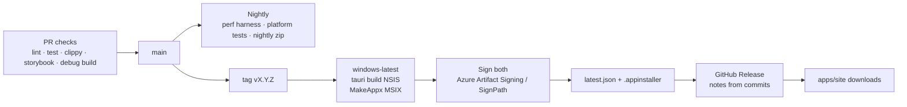

# 10 · Release & distribution

How a commit becomes something a user installs, updates and trusts. Decisions in
[ADR-0003](adr/0003-packaging-identity.md); API details in
[04-windows-platform-apis.md](04-windows-platform-apis.md#packaging-update-signing). The
pipeline *rules* — branching, required checks, gates, secrets, rollback, what agents may not
touch — live in [11-ci-cd.md](11-ci-cd.md); this document describes the artifacts and steps.

## Artifacts

| Artifact | Identity | Update path | Audience |
| ---------- | ---------- | ------------- | ---------- |
| `Muna_<ver>_x64.msix` | Yes (package) | App Installer (`.appinstaller` feed) / Microsoft Store later | Default download |
| `Muna_<ver>_x64-setup.exe` (NSIS) | Yes via external-location manifest; falls back to none | `tauri-plugin-updater` (`latest.json`, minisign) | Users who can't install MSIX (policy, older Win10) |
| `Muna_<ver>_x64-portable.zip` | No | Manual | Testers |
| ARM64 variants | Same | Same | Best effort from M5 |

## Versioning

- SemVer; single source of truth `version` in `apps/desktop/package.json`, propagated by a
  `scripts/version.ts` to `Cargo.toml`, `tauri.conf.json`, `AppxManifest.xml` (MSIX needs
  4-part `x.y.z.0`).
- Conventional Commits → `CHANGELOG.md` via `release-please` (or `changesets`).
- Channels: `stable` (tags `vX.Y.Z`), `beta` (`vX.Y.Z-beta.N`), `nightly` (unsigned, CI only,
  labelled in the tray tooltip).

## Pipeline

### `release.yml` steps

The workflow lives at [`.github/workflows/release.yml`](../.github/workflows/release.yml).

0. Preflight (ubuntu): tag is `vX.Y.Z[-beta.N]`, matches `apps/desktop/package.json`, and the
   commit is on `main`; manual runs default to a **dry run** (unsigned, nothing published).
1. Checkout, pnpm + Rust caches, `pnpm install --frozen-lockfile`.
2. `tauri build --no-bundle` → `muna.exe`; **sign the binary first** (Azure Artifact Signing via
   OIDC) so the packaged executable carries a signature, then `tauri bundle --bundles nsis` →
   NSIS installer (`bundle.windows.nsis`, `webviewInstallMode: downloadBootstrapper`,
   `installMode: currentUser`).
3. `scripts/msix/build.ts`: stage the built `apps/desktop/src-tauri/target/release/` output,
   render `AppxManifest.xml` (version, publisher, capabilities), `MakeAppx pack /nv`.
4. Sign installers: `signtool sign /fd SHA256 /tr <tsa> /td SHA256` through the
   `azure/trusted-signing-action` (OIDC federated credential from GitHub Environment `release`).
5. `tauri signer sign` (minisign) on the *signed* NSIS installer; generate `latest.json`.
6. Generate `Muna.appinstaller` pointing at the versioned release asset URL, with its own
   `Uri` at `releases/latest/download/Muna.appinstaller`.
7. CycloneDX SBOMs, `signtool verify`, `actions/attest-build-provenance` for every asset.
8. Publish (ubuntu): upload assets to the release created by release-please (or create it),
   clear the draft flag, trigger `apps/site` deploy.

### Secrets & environments

- GitHub Environment `release` with required reviewers; secrets: `AZURE_TENANT_ID`,
  `AZURE_CLIENT_ID`, `AZURE_SUBSCRIPTION_ID` (OIDC), `TAURI_SIGNING_PRIVATE_KEY`,
  `TAURI_SIGNING_PRIVATE_KEY_PASSWORD`; variables `AZURE_SIGNING_ENDPOINT`,
  `AZURE_SIGNING_ACCOUNT`, `AZURE_SIGNING_PROFILE`. Full table and rotation rules in
  [11-ci-cd.md](11-ci-cd.md#secrets-and-environments).
- No certificates in the repo. Installing a locally built MSIX for testing uses an ephemeral
  self-signed cert created on that machine and never uploaded.

## Installer behaviour

- **NSIS**: per-user, no admin; installs WebView2 bootstrapper if missing; registers
  external-location identity (`Add-AppxPackage -ExternalLocation`) and rolls back silently
  if it fails; optional autostart; uninstall restores native OSD and removes AppBar.
- **MSIX**: capabilities listed in ADR-0003; `windows.startupTask` disabled until user opts in;
  `unvirtualizedResources` so settings live in `%APPDATA%\Muna` for both installers.
- **Upgrade**: settings schema migrations run on first launch; previous version's
  `settings.json` backed up as `settings.<ver>.bak`.
- **Uninstall**: leaves `%APPDATA%\Muna` unless the user ticks "remove my data".

## Update UX

- Check on launch + every 6 h (`updater.endpoints`), silent download, notch notice "Update
  ready — Restart" with a 24 h snooze; never auto-restart while media plays or a Pomodoro runs.
- MSIX users see App Installer prompts; the notice deep-links to `ms-appinstaller:`.

## Release checklist

- [ ] Milestone exit criteria met; perf nightly green 7 days.
- [ ] `CHANGELOG.md` reviewed for user language.
- [ ] Fresh-install + upgrade tested on Win10 22H2 and Win11 24H2 (MSIX and NSIS).
- [ ] Signature verified (`Get-AuthenticodeSignature`, `Get-AppxPackage`).
- [ ] Native OSD restored after uninstall; no AppBar left registered.
- [ ] Site downloads and `latest.json` point at the new version.

## Store readiness (post-1.0)

Same MSIX; pass Windows App Certification Kit (note tauri #14935 S-mode check), Store listing
assets from `apps/site`, privacy policy page (no telemetry).
