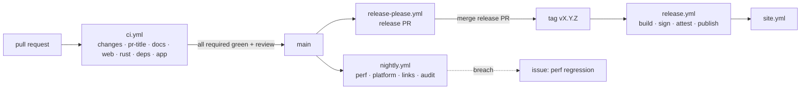

# 11 · CI/CD rules

The rulebook for how code reaches `main` and how `main` reaches users. Artifacts, installer
and update behaviour live in [10-release-distribution.md](10-release-distribution.md); test
content lives in [09-testing-qa.md](09-testing-qa.md). This document is normative: every
workflow, ruleset and agent must follow it, and changes to it go through a PR reviewed by the
maintainer.

## Principles

1. **`main` is always releasable.** Every commit on `main` passed the full required check set;
   a release is a tag on `main`, never a build from a branch.
2. **Green means green.** No `continue-on-error`, no skipped required checks, no widened
   budgets to make a PR pass. A failing check is fixed at the root or the PR waits.
3. **Deterministic on PRs, exploratory at night.** PR-blocking checks never depend on the
   network beyond package registries; external link checks, live platform probes and long
   perf runs happen in the nightly workflow and open issues instead of blocking.
4. **Reproducible from a clean runner.** Any artifact can be rebuilt from a tag on a fresh
   `windows-latest` runner with only the documented secrets. No manual steps, no local builds.
5. **Least privilege everywhere.** Workflows default to `contents: read`; secrets live in
   GitHub Environments; third-party actions are pinned to commit SHAs.
6. **Windows is the truth.** Anything that touches Rust, Tauri or Playwright runs on
   `windows-latest`; Linux runners are used for docs, pure-web jobs and Docker-based checks
   (`cargo-deny`) to save minutes.
7. **Docs and code move together.** A PR that changes tokens, presets, budgets, contracts or
   an ADR updates the corresponding doc in the same PR; CI checks generated files for drift.

## Branching and merging

- **Trunk-based.** One long-lived branch: `main`. Everything else is a short-lived branch
  created from `main` and deleted after merge.
- **Branch names**: `<milestone>-<epic>-<slug>` for planned work (`m1-e1-notch-shell`),
  `fix/<slug>`, `docs/<slug>`, `chore/<slug>` otherwise. Copilot sessions may keep their
  app-generated names; the PR title carries the meaning.
- **Merge method**: squash-merge only. The PR title becomes the commit subject, so the PR
  title must be a valid Conventional Commit (checked by CI). Linear history is required.
- **Keep branches fresh** by rebasing (or "Update branch" with rebase) — never merge `main`
  into a feature branch. Force-push to your own branch is fine; to `main` it is impossible.
- **Size**: aim for ≤ 400 changed lines excluding generated bindings, snapshots and lockfiles.
  Larger epics ship as a stack of dependent PRs; each layer is independently green.
- **Drafts** for work in progress; CI runs on drafts too, but reviewers are not requested.

## Commits and PR titles

Conventional Commits 1.0: `<type>(<scope>)!: <subject>`.

| Field | Rule |
| ------- | ------ |
| `type` | `feat`, `fix`, `perf`, `refactor`, `docs`, `test`, `build`, `ci`, `chore`, `revert` |
| `scope` | A module id (`media`, `hud`, `calendar`, …, see [modules](modules/README.md)), or `shell`, `scheduler`, `platform`, `contracts`, `ui`, `motion`, `settings`, `site`, `i18n`, `deps`, `release` |
| `!` / `BREAKING CHANGE:` | Any change that breaks the module contract, settings schema, or updater manifest format |
| Subject | Imperative, starts lower-case (`add`, not `Add`), no trailing full stop, ≤ 72 characters — enforced by the `pr-title` check |
| Trailer | Agent-authored commits carry `Co-authored-by: Copilot App <223556219+Copilot@users.noreply.github.com>` |

Versions and the changelog are derived from these titles, so a `feat` that users cannot see
(internal refactor) must be labelled `refactor`, and a user-visible fix must be `fix`, not
`chore`.

## Protection rules

Configured as **repository rulesets** (Settings → Rules) so they apply to admins too. Bypass
is granted to nobody; emergencies use the revert runbook below.

| Target | Rules |
| -------- | ------- |
| `main` | Require a pull request · 1 approving review · dismiss stale approvals on push · require review from code owners (`.github/CODEOWNERS`) · require conversation resolution · require the status checks listed below (strict: branch up to date) · require linear history · block force pushes · block deletion · require signed commits *recommended* (enable once all maintainers sign) |
| `v*` tags | Restrict creation to the `release-please` bot and the maintainer · block deletion · block updates (tags are immutable — a bad release gets a new patch version, never a moved tag) |
| Workflows | `.github/workflows/**`, `.github/CODEOWNERS`, `.github/dependabot.yml`, `deny.toml`, `release-please-config.json`, `scripts/msix/**`, `scripts/version.mjs`, the design/motion contracts (`docs/05`, `docs/06`, `packages/ui/src/tokens/`) and the module contract (`docs/adr/**`, `packages/contracts/**`) are code-owned by the maintainer in [`.github/CODEOWNERS`](../.github/CODEOWNERS); changes need their explicit review |

Repository settings that back the rules: squash-merge only (merge commits and rebase-merge
disabled), auto-delete head branches, secret scanning + push protection on, Dependabot alerts
and security updates on, "Require approval for all outside collaborators" for Actions on fork
PRs, default workflow permissions **read**, "Allow GitHub Actions to create and approve pull
requests" **off** (release-please uses a fine-grained PAT stored as `RELEASE_PLEASE_TOKEN`).

**Plan limitation (recorded 2026-09-15 by the M0 closing PR).** On the GitHub Free plan a
*private* repository cannot have rulesets, protected environments, secret scanning, push
protection or private vulnerability reporting — the API answers `403 Upgrade to GitHub Pro or
make this repository public`. Until the repository is public or on a paid plan, `main` is
protected by convention only (squash-only merges, the required checks `ci.yml` reports, and
the rules for agents below), and the `release` environment cannot get its required reviewer.
Unprotected environments do work: `release-dry-run` was created on first use by the I9 dry
run. Everything that needs no plan change is already in place — see the ticks below.

### Bootstrap checklist (maintainer, once)

Nothing in this list can be done from a PR; the repository owner performs it and ticks it in
the M0 exit criteria. Ticks below were verified through the REST API on 2026-09-15; items
marked *plan* wait for a public repository or a paid plan.

- [ ] *plan* Ruleset `main` as in the table above; required checks `changes`, `pr-title`,
      `docs`, `web`, `rust`, `deps`, `app` (all seven have reported since PR #3)
- [ ] *plan* Ruleset `v*` tags: restrict creation, block deletion and updates
- [x] Merge settings: squash only (merge commits and rebase-merge off), default squash message
      = PR title + body, auto-delete branches
- [x] Actions settings: default permissions read-only, PR creation by Actions off. Fork-PR
      approval is not a setting on private repositories (GitHub rejects it) — turn it on the
      day the repository goes public
- [ ] Security: Dependabot alerts and security updates **on**; *plan* secret scanning, push
      protection, private vulnerability reporting
- [ ] *plan* Environment `release`: required reviewer (maintainer), deployment tags `v*`,
      secrets and variables from the [table](#secrets-and-environments); Azure federated
      credential with subject `repo:miklol/Muna:environment:release`. (`release-dry-run`
      exists — auto-created by the I9 dry run, no protection, no secrets, as designed)
- [ ] Repository secret `RELEASE_PLEASE_TOKEN`, repository variable `RELEASE_AUTOMATION=true`
      (M0 has landed — set both now). Labels `ci:nightly`, `dependencies`, `ci`, `npm`,
      `cargo`, `perf-regression`, `flaky-test` exist
- [ ] Verify `releases/latest/download/latest.json` resolves after the first stable release

## Workflows

| Workflow | Trigger | Runner | Purpose | Blocking |
| ---------- | --------- | -------- | --------- | ---------- |
| `ci.yml` | `pull_request`, `push` to `main` | ubuntu (changes, pr-title, docs, web, deps) + windows (rust, app) | Required checks | Yes |
| `nightly.yml` | `schedule` 03:00 UTC, `workflow_dispatch` | ubuntu (links, deps) + windows (perf, platform, nightly-zip) | Full perf harness, platform tests, external link check, dependency re-audit, unsigned nightly zip | No — opens/updates a `ci:nightly` issue |
| `release.yml` | `push` tag `v*`, `workflow_dispatch` (dry run) | windows (build) + ubuntu (preflight, publish) | Build, sign, attest, publish (see [10](10-release-distribution.md#pipeline)) | Environment-gated |
| `release-please.yml` | `push` to `main` (no-op until repository variable `RELEASE_AUTOMATION=true`) | ubuntu | Maintains the release PR (version bump + `CHANGELOG.md`); merging it creates the tag | — |
| `site.yml` | `push` to `main` touching `apps/site/**`, after a release | ubuntu | Build and deploy `apps/site` to GitHub Pages | — |
| `codeql.yml` | `pull_request` (JS/TS only), weekly schedule | ubuntu | CodeQL for JavaScript/TypeScript; Rust is covered by `cargo deny`/`cargo audit` | Weekly: no; PR: yes once enabled |



### Rules for writing workflows

- Top-level `permissions: contents: read`; raise per job only for what that job needs
  (`pull-requests: write` to comment, `id-token: write` + `attestations: write` to sign and
  attest, `issues: write` for nightly). Never `write-all`.
- Official `actions/*` and `github/*` actions may be referenced by major tag; **every other
  action is pinned to a full commit SHA** with a `# vX.Y.Z` comment. Dependabot keeps both
  current.
- `actions/checkout` always sets `persist-credentials: false`.
- Trigger on `pull_request`, never `pull_request_target`, and never expose secrets to jobs
  that run fork code. Fork PRs get read-only tokens and skip steps that comment or upload.
- Every job has `timeout-minutes`. Whole-PR budget is **15 minutes** wall clock; a job that
  regularly exceeds its budget is split or cached, not given more time.
- `concurrency` groups cancel superseded runs **on PRs only**; runs on `main`, tags and
  schedules are never cancelled.
- **Gate jobs with `needs` + outputs, not workflow-level `paths:` filters** — a required check
  that never starts leaves the PR blocked forever, while a job skipped by `if:` reports
  *skipped* and satisfies the ruleset. The `changes` job computes `code` (anything outside
  Markdown/docs changed) and `app` (`apps/desktop/package.json` exists) once; downstream jobs
  consume them. `hashFiles()` is not available in job-level `if:`, which is why the probe job
  exists.
- Docker-based actions (e.g. `cargo-deny-action`) only run on Linux runners; Windows jobs
  call the underlying CLI or the check moves to an ubuntu job.
- Pass untrusted values (PR titles, branch names, commit SHAs) to scripts through `env:`,
  never by interpolating `${{ }}` inside `run:`.
- Caching: pnpm store keyed on `pnpm-lock.yaml`; cargo via `Swatinem/rust-cache` keyed on
  `Cargo.lock` and the job name; Playwright browsers are not needed (WebView2 is on the
  runner). Cache misses must not fail a job.
- Install with `pnpm install --frozen-lockfile`; a lockfile change is a reviewable diff.
- Matrix only where it buys information (Windows Server 2022 vs 2025 images for the shell
  suite). Windows 10 cannot run on GitHub-hosted runners: it is covered by the QA matrix in
  [09](09-testing-qa.md#manual-qa-matrix-milestone-close) and, later, an opt-in self-hosted
  runner.
- Scripts longer than five lines live in `scripts/` (PowerShell for Windows jobs, Node for
  cross-platform) and are runnable locally with the same arguments CI uses.

## Required checks

Job ids double as the required-status-check names in the `main` ruleset. Do not rename a job
without updating the ruleset in the same change.

| Check (`ci.yml` job) | Runner | Runs when | Contents |
| ---------------------- | -------- | ----------- | ---------- |
| `changes` | ubuntu | always | Probe: outputs `code` and `app` for the gates below |
| `pr-title` | ubuntu | every PR | Conventional Commit title with an allowed type; subject starts lower-case |
| `docs` | ubuntu | every PR/push | `markdownlint-cli2` with `.markdownlint-cli2.jsonc`; `scripts/check-links.mjs` (relative links + heading anchors; deterministic, no network) |
| `web` | ubuntu | code changed and `apps/desktop` exists | `pnpm install --frozen-lockfile`, `lint` (ESLint/Stylelint/Prettier), `typecheck`, `test` (Vitest incl. tokens snapshot, coverage report), `i18n:check`, `storybook:ci` (`build-storybook` + `test-storybook` with axe on every story) |
| `rust` | windows | code changed and `apps/desktop` exists | web build (tauri-build embeds `frontendDist`), `cargo fmt --check`, `cargo clippy --all-targets -- -D warnings`, `cargo test` (fake platform), contracts drift (`contracts:generate` then `git diff --exit-code -- packages/contracts`; tauri-specta needs the Rust toolchain) |
| `deps` | ubuntu | code changed and `apps/desktop` exists | `cargo deny check` (advisories, licences, bans, sources — Docker action, hence Linux), `pnpm audit --prod --audit-level high`, `licenses:check` |
| `app` | windows | code changed and `apps/desktop` exists | `tauri build --debug --no-bundle`, `bundle:check`, Playwright shell scenario suite S1–S14 against the debug build, perf smoke (`perf:smoke`: startup, idle CPU, RSS) posted as a PR comment, upload debug exe + traces on failure |

Skipped `web`/`rust`/`deps`/`app` on a docs-only PR is by design; the ruleset treats them as
satisfied.

## Quality gates

| Gate | Tool | Threshold | Where |
| ------ | ------ | ----------- | ------- |
| Formatting | Prettier, `cargo fmt` | Zero diffs | `web`, `rust` |
| Lint | ESLint strict-type-checked + jsx-a11y + react-hooks, Stylelint, Clippy | Zero warnings (`-D warnings`) | `web`, `rust` |
| Types | `tsc --noEmit` (strict, `noUncheckedIndexedAccess`) | Zero errors | `web` |
| Unit tests | Vitest, `cargo test` | All pass; no `.only`, no `skip` without an issue link | `web`, `rust` |
| Coverage | Vitest v8 provider | `packages/ui` and `src/modules/**` ≥ 80 % lines; repo total may not drop > 1 % vs `main` | `web` (report), nightly (trend) |
| Storybook | `build-storybook`, `test-storybook` with axe | Every component has a story; zero serious/critical axe violations | `web` |
| Contracts | tauri-specta regeneration | Committed bindings identical to generated | `rust` |
| Design tokens | Vitest snapshot of `tokens.css` | Snapshot changes only with a docs change in the same PR | `web` |
| i18n | `scripts/i18n-check.mjs` | No missing/unused keys in `en`; other locales may lag | `web` |
| Shell scenarios | Playwright S1–S14 | All pass on Windows Server 2022 image; 1 automatic retry allowed for Playwright only | `app` |
| Perf smoke | `scripts/perf --smoke` | Startup < 1.5 s, idle CPU ≤ 0.3 %, RSS ≤ 120 MB (PRD budgets) | `app` |
| Bundle size | `scripts/bundle-size.mjs` | Frontend JS ≤ 1.2 MB gzipped; exe ≤ 12 MB; MSIX ≤ 20 MB | `app`, `release` |
| Licences | `cargo deny check licenses`, `license-checker-rseidelsohn` | Allow: MIT, Apache-2.0, BSD-2/3, ISC, MPL-2.0, Zlib, Unicode-3.0, CC0-1.0, OFL-1.1 (fonts). Deny: GPL, AGPL, LGPL, SSPL, BUSL, unknown | `deps` |
| Vulnerabilities | `cargo deny check advisories`, `pnpm audit --prod` | No high/critical without a documented exception in `deny.toml` / `.pnpm-audit.json` with an expiry date | `deps`, nightly |
| Secrets | GitHub secret scanning + push protection | Zero | always |
| Docs | markdownlint, `check-links.mjs` | Zero | `docs` |

A gate is raised only through a PR that updates this table and, where relevant, the PRD
budgets. Gates are never lowered to unblock a PR.

## Performance gates

- **PR (`app`)**: `pnpm -w perf:smoke -- --out perf-smoke.json --markdown perf-smoke.md`
  starts the debug build the job just made, measures cold start, waits 5 s, samples 30 s of
  idle CPU and keeps sampling memory until the shell's idle trim has settled (90 s), and the
  job posts the markdown as a PR comment (edited in place through its
  `<!-- muna-perf-report -->` marker; skipped on fork PRs). Breaching a PRD budget fails the
  check. The comment's delta column fills in when the run is given `--baseline <json>`; the
  automatic delta against the last `main` run is not wired yet (the `perf-smoke.json` artifact
  of every run is kept so it can be).
- **Nightly**: `perf:full` — the harness's full plan from
  [09](09-testing-qa.md#performance-harness-scriptsperf): 30 s warm-up, 60 s idle CPU, memory
  to 300 s, 20 cursor-driven expand/collapse cycles with the shell's per-morph frame reports.
  The workflow builds `--debug --no-bundle`, so today's nightly numbers describe the debug
  build; the 100-cycle, 10-minute idle, media-playing and 4K 150 % emulation passes and the
  release build are the target state, not yet implemented. Results are appended to the
  `perf-history` branch as JSON; `apps/site` renders the trend.
- **Regression rule**: a nightly metric worse than the 7-day median by > 10 % (or any budget
  breach) fails the `perf` job; the `report` job then opens or updates the open `ci:nightly`
  issue with the run link and the offending commits since the last green run. The maintainer
  labels it `perf-regression`; it must be resolved or explicitly accepted before the next
  release.

## Dependencies and supply chain

- **Dependabot** (`.github/dependabot.yml`): weekly, Monday 06:00 UTC, grouped
  minor+patch updates per ecosystem (`github-actions`, `npm`, `cargo`); majors arrive as
  separate PRs. Dependabot PRs pass the same checks; auto-merge is allowed only for
  `github-actions` and dev-dependency patch updates once CI is green.
- **Pinning**: lockfiles committed (`pnpm-lock.yaml`, `Cargo.lock`); `packageManager` field in
  the root `package.json`; Rust toolchain pinned in `rust-toolchain.toml` (stable channel with
  an explicit version bumped deliberately); Node major pinned in `.node-version`.
- **`cargo deny`** with `deny.toml` (licences allowlist above, `wildcards = "deny"`,
  `multiple-versions = "warn"`, advisory database) runs on every code PR in the `deps` job and
  again nightly, because advisories appear without a code change.
- **Advisories in dev-only transitive packages** (`pnpm audit --prod` ignores them, Dependabot
  does not): fix them with an entry in `overrides` in `pnpm-workspace.yaml` that names the
  advisory and the dependant pinning the old range, then verify the tool that uses the package
  still runs; drop the entry once the dependant moves on. Linux-only crates that reach
  `Cargo.lock` through Tauri's gtk chain (never compiled for the Windows target) are dismissed
  in the Dependabot UI as "vulnerable code is not actually used", with the reason in the
  dismissal comment.
- **New dependencies** need a one-line justification in the PR ("why not the platform API /
  an existing dep"). Anything with native code, network access at runtime, or > 200 kB
  gzipped needs `muna-architect` review.
- **No AGPL/GPL code** in the repo, even vendored or "adapted" — several reference repos are
  AGPL; they are read for ideas, never copied (see [04](04-windows-platform-apis.md)).
- **SBOM and provenance**: `release.yml` produces CycloneDX SBOMs (`cargo cyclonedx`,
  `@cyclonedx/cyclonedx-npm`) and a build-provenance attestation
  (`actions/attest-build-provenance`) for every published artifact.

## Secrets and environments

| Name | Type | Where | Used by |
| ------ | ------ | ------- | --------- |
| `AZURE_TENANT_ID`, `AZURE_CLIENT_ID`, `AZURE_SUBSCRIPTION_ID` | Environment `release` (secrets; OIDC federated credential, no client secret) | `azure/login` → Azure Artifact Signing | `release.yml` `build` |
| `AZURE_SIGNING_ENDPOINT`, `AZURE_SIGNING_ACCOUNT`, `AZURE_SIGNING_PROFILE` | Environment `release` (variables) | Azure Artifact Signing | `release.yml` `build` |
| `TAURI_SIGNING_PRIVATE_KEY`, `TAURI_SIGNING_PRIVATE_KEY_PASSWORD` | Environment `release` (secrets) | Updater manifest (minisign) | `release.yml` `build` |
| `RELEASE_PLEASE_TOKEN` | Repository secret (fine-grained PAT: contents + pull-requests write, 90-day expiry, calendar reminder) | Release PR and tag creation so `ci.yml`/`release.yml` trigger (events from `GITHUB_TOKEN` never start workflows) | `release-please.yml` |
| `RELEASE_AUTOMATION` | Repository variable (`true` once M0 lands) | Enables `release-please.yml` | `release-please.yml` |
| `OPENWEATHER_TEST_KEY` etc. | Environment `nightly` | Live integration probes | `nightly.yml` only |

Environments: `release` (required reviewer = maintainer, deployment branches/tags restricted to
`v*`, holds every signing secret) and `release-dry-run` (no protection, **no secrets**; dry runs
run here so they need no approval and cannot sign). GitHub creates `release-dry-run`
automatically on first use; `release` must be created and protected by hand before the first
beta.

Rules: no certificate files, tokens or `.env` files in the repo (push protection enforces it);
secrets are never echoed, never passed as command-line arguments visible in logs (use env
vars), never available to fork PRs; rotate on any suspected exposure and note the rotation in
the release issue. Installing a locally built MSIX for testing uses an ephemeral self-signed
certificate created on that machine (`scripts/msix/test-cert.ps1`) and never committed or
uploaded.

## Artifacts and retention

| Artifact | Produced by | Retention |
| ---------- | ------------- | ----------- |
| Debug `muna.exe` (unsigned) + perf smoke JSON; Storybook static | `ci.yml` `app` / `web` | 7 days |
| Playwright report, traces and videos | `ci.yml` `app` (on failure) | 14 days |
| Nightly portable zip | `nightly.yml` `nightly-zip` | 14 days |
| Nightly perf JSON/Markdown; `perf-history` commit | `nightly.yml` `perf` | 90 days (branch: forever) |
| Dry-run bundle (unsigned) | `release.yml` `build` (dry run) | 7 days |
| MSIX, NSIS, `latest.json`, `.appinstaller`, SBOMs, attestations | `release.yml` `publish` | Forever (GitHub Release assets) — never deleted, even for yanked versions |

Artifacts uploaded from PRs are never executed by later workflows (no artifact → workflow
promotion); releases rebuild from the tag.

## Release rules

- **Versioning** is automated by release-please from Conventional Commits: `feat` → minor,
  `fix`/`perf` → patch, `!` → major (pre-1.0: major bumps are mapped to minor via
  `bump-minor-pre-major`). The release PR updates `apps/desktop/package.json`, `Cargo.toml`
  and `tauri.conf.json` (`extra-files` in `release-please-config.json`) and `CHANGELOG.md`;
  `scripts/version.mjs` derives the 4-part MSIX version at build time. The `v*` tag it pushes
  triggers `release.yml`.
- **Preflight** in `release.yml` refuses to build when the tag is not `vX.Y.Z[-beta.N]`, the
  package version does not match the tag, or the tagged commit is not on `main`.
- **Channels**: `vX.Y.Z-beta.N` → `beta` updater channel and GitHub pre-release;
  `vX.Y.Z` → `stable`. Every stable release is preceded by at least one beta that has been
  installed by the maintainer on Win10 22H2 and Win11 for ≥ 3 days with the nightly perf
  green throughout. Nightlies are unsigned, labelled, and never offered through the updater.
- **Release checklist** in [10](10-release-distribution.md#release-checklist) is copied into
  the release PR description and ticked before merge.
- **Hotfix**: branch from the tag (`hotfix/vX.Y.Z+1`), cherry-pick the fix, open a PR to
  `main` first (so `main` has it), then the release PR picks it up; never tag from the hotfix
  branch itself.
- **Rollback**: releases are immutable — no tag moves, no asset is rewritten. `latest.json`
  and `Muna.appinstaller` are always fetched from `releases/latest/download/…`, which GitHub
  resolves to the newest *stable* release. To roll back, mark the bad release as
  **pre-release** with a "yanked" note: the feed instantly points at the previous good version
  again. Then ship a patch; users already on the bad build receive the patch, never a
  downgrade. Assets stay online so installed users can be diagnosed.
- **Dry runs**: `release.yml` accepts `workflow_dispatch` with `dry_run: true` (the default for
  manual runs) — builds NSIS, MSIX, `.appinstaller` and SBOMs **unsigned** in the
  `release-dry-run` environment, skips signing, attestation and publishing, and uploads the
  bundle for 7 days. Run it before the first beta of every minor.

## Flaky tests and a red `main`

- A test that fails without a code cause is **quarantined within 24 hours**: mark it
  `test.fixme` / `#[ignore]` with a link to a `flaky-test` issue; the issue owner has one week
  to fix or delete it. Quarantined tests are listed in the nightly summary.
- Only the Playwright shell suite may use an automatic retry (1). Unit tests and Rust tests
  never retry.
- If `main` goes red (a merge slipped through or an infra change broke it), the first
  responder **reverts within one hour** using a revert PR (`revert: …`) — no fixing forward on
  red `main`, no force pushes. The revert PR needs only the required checks, not a review
  cooling-off period.
- `workflow_dispatch` re-runs of a failed job are allowed once to rule out infra; a second
  failure is treated as real.

## Local parity

The same commands run locally and in CI, from the repo root:

```text
pnpm -w ci            # = lint + typecheck + test + i18n:check + storybook:ci   (what `web` runs)
pnpm -w ci:rust       # = desktop build + cargo fmt/clippy/test + contracts drift (what `rust` runs)
pnpm -w ci:deps       # = cargo deny check + pnpm audit + licenses:check          (what `deps` runs)
pnpm -w ci:app        # = tauri build --debug + bundle:check + e2e + perf:smoke  (what `app` runs)
pnpm -w docs:check    # = markdownlint-cli2 + node scripts/check-links.mjs        (what `docs` runs)
```

Until the scaffold exists, `docs:check` is `npx --yes markdownlint-cli2@0.23.2` and
`node scripts/check-links.mjs`. Git hooks (lefthook: format + lint on staged files, PR-title
lint on `commit-msg`) are recommended but optional; CI is the arbiter.

### Root scripts the workflows call

The workflows are written against these root `package.json` scripts; M0 must provide every one
of them (a stub that exits 0 with a clear "not implemented" message is acceptable until the
feature it checks exists). Renaming one is a `ci` change that updates the workflow in the same PR.

| Script | Contract |
| -------- | ---------- |
| `lint`, `typecheck`, `test` | Whole-workspace lint, `tsc --noEmit`, Vitest (`test -- --run --coverage` in CI) |
| `i18n:check` | `scripts/i18n-check.mjs`; fails on missing/unused `en` keys |
| `storybook:ci` | `build-storybook` into `packages/ui/storybook-static`, then `test-storybook` with axe against it |
| `contracts:generate` | Regenerates `packages/contracts` from tauri-specta; CI diffs the result |
| `licenses:check` | `license-checker-rseidelsohn` with the allowlist above |
| `bundle:check` | `scripts/bundle-size.mjs` against the budgets above |
| `e2e` | Playwright shell scenario suite S1–S14 against the debug build; report in `apps/desktop/playwright-report` |
| `perf:smoke`, `perf:full` | `scripts/perf` with `--out <json> --markdown <md>`; non-zero exit on budget breach |
| `msix:build` | `scripts/msix/build.mjs --version <v> --out <dir>`: renders both manifests from `scripts/msix/identity.json`, `MakeAppx pack /nv` → `Muna_<v>_x64.msix` + `Muna_<v>_x64-external.msix`, unsigned (`--test-sign` only for local installs) |
| `release:updater` | `tauri signer sign` on the NSIS installer and writes `latest.json` (`--version --tag --dir`) |
| `release:appinstaller` | Writes `Muna.appinstaller` (`--version --tag --dir`) |
| `release:verify` | `signtool verify /pa` on every exe/msix, minisign verification of the updater signature in Node (`scripts/release/minisign.mjs` — the Tauri CLI has no `signer verify`) against `plugins.updater.pubkey`, and `.appinstaller` ↔ MSIX consistency (`--dir`, optional `--version`) |
| `sbom` | CycloneDX 1.5 SBOMs for npm and cargo into `--out <dir>` (`scripts/sbom.mjs`, from `pnpm list`/`pnpm licenses` and `cargo metadata`) |

## Rules for agents

Copilot agents (see [`.github/agents`](../.github/agents)) work under the same rules as
people, plus:

1. Never disable, skip, `continue-on-error`, or reduce the scope of a check to get green; never
   edit thresholds in this document, `deny.toml`, budgets in the PRD or the tokens snapshot
   unless the task is explicitly about them, and then only with the rationale in the PR.
2. Never modify `.github/workflows/release.yml`, `.github/CODEOWNERS`, rulesets, environments
   or secrets unless acting as `muna-release-engineer` on an explicit task; the maintainer
   reviews those changes.
3. When CI fails, read the log, reproduce locally with the parity command, fix the root cause,
   and explain the cause in the PR. Re-running a job is allowed once and only for an infra
   error you can name.
4. A PR is finished only when all required checks are green, the PR template is filled with
   evidence (recording, perf numbers, tests), the spec status is updated, and the roadmap
   status table has an entry.
5. Agent-authored PRs need one human approval; an agent never approves or merges. The
   `muna-design-reviewer` and `muna-qa-engineer` reviews are advisory and do not replace it.
6. Commits carry the `Co-authored-by` trailer; PR titles follow the commit rules above; PR
   bodies name the agent and the kickoff prompt used.

## Runbooks

| Situation | Steps |
| ----------- | ------- |
| Red `main` | Identify the merge → open `revert:` PR → merge on green → reopen the original PR with the fix. |
| `ci:nightly` issue opened | Open the run → for `perf`: bisect with `pnpm -w perf:smoke` across the listed commits, fix or revert, close with numbers; for `links`: fix or allowlist the URL in `.lycheeignore`; for `deps`: patch or record an exception (below); for `platform`: reproduce on the QA machine. Close the issue by hand when the next nightly is green. |
| Signing failure in `release.yml` | Do not re-tag. Check the Azure federated credential (subject `repo:miklol/Muna:environment:release`) and certificate profile status → re-run the job → if the certificate is revoked, rotate, then bump patch and release again. |
| Expired `RELEASE_PLEASE_TOKEN` | Release PR stops updating. Create a new fine-grained PAT, update the secret, re-run `release-please.yml` via `workflow_dispatch`. |
| Dependabot PR fails CI | Never force-merge. If the failure is a genuine break, pin the dependency with a comment and an issue to unpin. |
| Vulnerability alert (high/critical) | Patch within 7 days or record an exception in `deny.toml` / `.pnpm-audit.json` with a 30-day expiry and a linked issue. |
| Runner image change breaks the shell suite | Pin the `runs-on` image (`windows-2022`) in the same PR, open an issue to unpin. |

## Checklists

**Adding or changing a workflow**

- [ ] Top-level `permissions: contents: read`; per-job escalation justified in a comment
- [ ] Third-party actions pinned to SHA with version comment; `persist-credentials: false`
- [ ] `timeout-minutes` on every job; concurrency group present; PR-only cancellation
- [ ] Gated via `changes` outputs, not `paths:`; job ids match the ruleset if required
- [ ] Scripts live in `scripts/` and run locally with the same arguments
- [ ] This document and [10](10-release-distribution.md) updated if behaviour changed

**Adding a required check**

- [ ] Runs on every PR (or is deliberately skipped via `if:` on docs-only PRs)
- [ ] Deterministic (no external network), finishes inside the 15-minute PR budget
- [ ] Added to the `main` ruleset and to the *Required checks* table above
- [ ] Parity command exists in the root `package.json`

## References

- GitHub Docs — Rulesets: <https://docs.github.com/repositories/configuring-branches-and-merges-in-your-repository/managing-rulesets>
- GitHub Docs — Security hardening for GitHub Actions:
  <https://docs.github.com/actions/security-for-github-actions/security-guides/security-hardening-for-github-actions>
- GitHub Docs — Using artifact attestations: <https://docs.github.com/actions/security-for-github-actions/using-artifact-attestations>
- Conventional Commits 1.0: <https://www.conventionalcommits.org/en/v1.0.0/>
- release-please: <https://github.com/googleapis/release-please>
- cargo-deny: <https://embarkstudios.github.io/cargo-deny/>
- OpenSSF Scorecard checks (pinned dependencies, token permissions, branch protection):
  <https://github.com/ossf/scorecard/blob/main/docs/checks.md>
- Tauri v2 — Updater plugin and signing: <https://v2.tauri.app/plugin/updater/>
- Azure Artifact Signing (Trusted Signing) GitHub Action: <https://github.com/Azure/trusted-signing-action>
