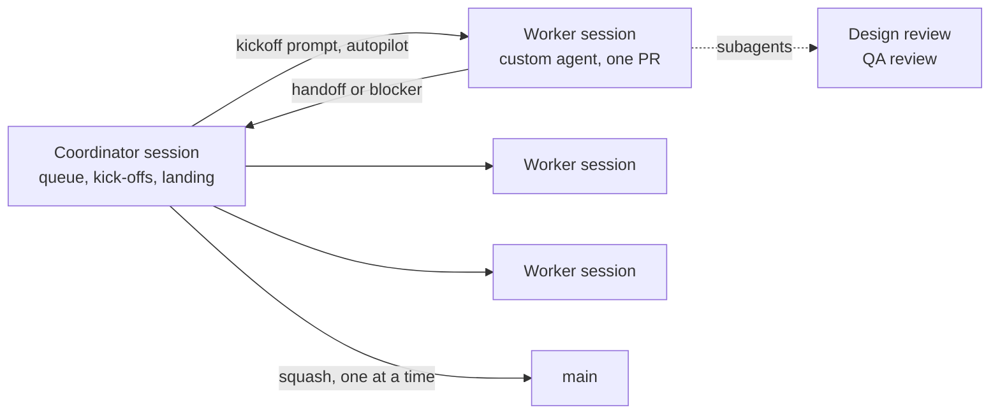

# Build plan · kickoff prompts

Paste-ready prompts for Copilot sessions or the custom agents in `.github/agents`. Each prompt
is self-contained: it names the agent, the docs to read, the deliverable, and the exit
criteria. Run them in order inside a milestone; epics inside a milestone can run in parallel
sessions (one branch each).

| Milestone | File | Epics |
| ----------- | ------ | ------- |
| M0 Foundations | [m0-foundations.md](m0-foundations.md) | Scaffold · Transparent-window spike · Identity spike · Tokens & presets |
| M1 Shell | [m1-shell.md](m1-shell.md) | Notch shell · Live activities · Settings · Panel chrome · Onboarding |
| M2 Media & HUD | [m2-media-hud.md](m2-media-hud.md) | Media backend · Media UI · HUD · Perf harness |
| M3 Daily modules | [m3-daily-modules.md](m3-daily-modules.md) | Calendar · To-do · Pomodoro · Weather · Notifications · Day progress · Bluetooth · System monitor · Dashboard |
| M4 Power tools | [m4-power-tools.md](m4-power-tools.md) | Drop actions · Shelf · Window snap · Code hosting · AI coding · Shortcuts · Notes · Screen time |
| M5 Ship | [m5-ship.md](m5-ship.md) | P2 modules · Fidelity pass · Accessibility · Release engineering · Site · Localization |

## How to run the work

One **coordinator** session plans, starts and lands the work. Short-lived **worker** sessions
build it: one item and one PR each. Independent PRs from `main` are faster than a stack — the
21-PR M2–M3 stack spent days on rebases and landing.

### Coordinator

1. Keeps the queue — the milestone's epics, open issues and carry-overs — ordered so that what
   keeps `main` and the nightly green comes first.
2. Starts each worker as a worktree session from `main`, named after the item
   (`m1-e1-notch-shell`, `fix-71-cold-expand`), in autopilot, with the agent the prompt names
   (`muna-architect` when unsure). The kickoff prompt comes from this folder or follows its
   shape: agent, docs to read, deliverable, exit criteria.
3. Runs **three or four workers at a time**, never two that change the same hotspot (below).
4. Lands green PRs one at a time (see [Landing](#landing)) and adds each to the milestone's
   status table in [`../07-roadmap.md`](../07-roadmap.md).
5. Brings a decision to the maintainer only when it changes scope, a budget, a contract or a
   code-owned file.

### Workers

1. Build one item, aiming for ≤ 400 changed lines
   ([branching](../11-ci-cd.md#branching-and-merging)). Larger work is split into independent
   PRs from `main` before it becomes a stack.
2. Review with subagents before the PR opens: `muna-design-reviewer` on any UI change,
   `muna-qa-engineer` on the shell, scheduler or a platform API. Blocking and *should* findings
   are fixed in the same PR.
3. Run the [local parity](../11-ci-cd.md#local-parity) commands before every push
   (`pnpm -w ci`, `ci:rust`, `ci:deps`, `ci:app`, `docs:check`), so CI confirms rather than
   debugs.
4. Finish the PR as [rule 4](../11-ci-cd.md#rules-for-agents) asks: a Conventional-Commit
   title, the template filled with evidence, the spec status updated. Leave
   `docs/07-roadmap.md` alone; the handoff carries the line for the status table.
5. Report back once: a handoff when every check is green, or a blocker with what was tried.
   Workers never merge.

### Hotspots

Parallel PRs that change these files conflict, so the coordinator never runs two such workers
at once:

- the module registries, `apps/desktop/src-tauri/src/modules/mod.rs` and
  `apps/desktop/src/modules/registry.ts`;
- the settings schema and store migrations in `muna-core` (each takes the next version);
- the generated bindings in `packages/contracts`;
- the locale catalogs in `packages/i18n/src/locales`;
- `docs/07-roadmap.md` — each status row is a single line, so only the coordinator edits it.

### Stacks

Stack only when a PR cannot build without another. Keep a stack at most three deep and land it
bottom-up with `scripts/land-stack.ps1`; every merge below forces a rebase above.

### Landing

- The coordinator squash-merges a worker's PR once every required check is green and every
  conversation is resolved; the ruleset asks for no approval
  ([protection rules](../11-ci-cd.md#protection-rules)). The maintainer reviews after the
  merge and reverts by the [runbook](../11-ci-cd.md#runbooks) when needed.
- One at a time: `main` requires branches to be up to date, so after each merge the next PR
  rebases (*Update branch* → rebase) and waits for green again.
- While the 14-day nightly window of
  [M5's exit criteria](../07-roadmap.md#m5--polish-p2-tail--10-4-weeks) runs, a PR touching
  the shell, scheduler or motion also records a local `pnpm -w perf:smoke`; one red nightly
  restarts the count.

### Maintainer only

Signing secrets, hardware passes (Win10 22H2, the soak machines, the 4K panel), rulesets and
environments stay with the maintainer. The coordinator records them as carry-overs in the
roadmap row instead of starting a worker.

### Single sessions

A one-off fix can skip the coordinator: the session is its own coordinator, building,
reviewing and landing its PR under the same rules.

## Conventions every prompt assumes

- Repo rules: `.github/copilot-instructions.md`; CI/CD rules: `docs/11-ci-cd.md`.
- Stack and layout: `docs/03-architecture.md`; decisions: `docs/adr/`.
- Platform APIs: `docs/04-windows-platform-apis.md`.
- Design: `docs/05-design-system.md`; motion: `docs/06-motion-spec.md`.
- Module contract: `docs/adr/0004-module-contract.md`; spec template: `docs/modules/README.md`.
- Tests: `docs/09-testing-qa.md`.
