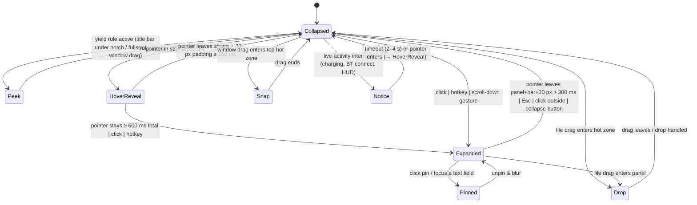

# Notch shell

**Tier P0 · Owner: `muna-shell-engineer` + `muna-ui-engineer` · Status: spec**

## Purpose

The always-running host that draws the notch on each enabled monitor, owns the collapsed strip
↔ expanded panel state machine, hosts modules, and handles Windows placement rules. Everything
else plugs into it.

## Reference

MacNotch screenshots `demo-01`, `live-feature-3/4`, `media-feature-5`; anatomy in
[`../reference/ui-observations.md`](../reference/ui-observations.md).

## Windows & processes

| Window | Purpose | Flags |
|--------|---------|-------|
| `notch-<monitorId>` | One per enabled monitor. Hosts strip + panel + module bar in a single transparent WebView, sized to the max expanded bounds; hit-testing limited to painted regions. | `WS_EX_TOOLWINDOW`, `WS_EX_NOACTIVATE` (until a text field is focused), `WS_EX_TOPMOST`, `WS_EX_LAYERED`; `transparent: true`, `decorations: false`, `shadow: false`, `skipTaskbar: true`; `WDA_EXCLUDEFROMCAPTURE` when *Hide from captures* is on |
| `settings` | Standard decorated window (Mica if available). | normal |
| `overlay-eyebreak` | Full-screen dim overlay for Health eye breaks / Timer Done. | topmost, transparent, click-through except buttons |

Single process (Tauri core) + WebView2 renderer processes. A small **watchdog** thread restores
the native volume OSD and the AppBar reservation if the process dies unexpectedly (see HUD spec).

## States

Rules:
- Hover-intent uses the pointer's **velocity**: fast pass-throughs (> 800 px/s) never trigger
  HoverReveal. Reference apps use 300 ms intent (boring.notch) and 100 ms hover-out grace;
  Muna uses 250 ms / 300 ms with a 30 px extended hover padding around the shape so small
  pointer excursions don't collapse the panel.
- Expanded panel is dismissed by `Esc`, clicking outside, or the ⤡ button. `Pinned` (when a
  text field has focus or the user clicks the pin) disables auto-collapse.
- While `Expanded`, module switching via module bar, right rail, `Ctrl+Tab`/`Ctrl+Shift+Tab`,
  and per-module hotkeys. Global toggle hotkey default `Ctrl+Alt+Space`.
- Muna never steals focus unless the user clicks a text field (`WS_EX_NOACTIVATE` toggled).
- Hide/park transitions are debounced 500 ms so flapping fullscreen detection never flickers.

## Placement

- **Monitor enumeration**: `EnumDisplayMonitors` + `GetMonitorInfoW`; re-run on
  `WM_DISPLAYCHANGE` / `WM_DPICHANGED`; per-monitor DPI v2.
- **Horizontal anchor**: monitor centre + user offset (px). **Vertical**: top edge + user offset.
- **Modes**: *Overlay* (default) or *Reserved strip* (AppBar via `SHAppBarMessage` `ABM_NEW`,
  `ABM_QUERYPOS`, `ABM_SETPOS` on `ABE_TOP`; released on exit).
- **Yield rules (Overlay mode)**: foreground window rect (via `DwmGetWindowAttribute
  DWMWA_EXTENDED_FRAME_BOUNDS`) whose top ≤ strip bottom and horizontally overlapping the strip
  by > 40 % → `Peek`; fullscreen → hide (park), detected by `SHQueryUserNotificationState` ∈
  {BUSY, RUNNING_D3D_FULL_SCREEN, PRESENTATION_MODE} **or** the PILLAR heuristic: foreground
  rect covers ≥ 90 % of `rcMonitor` and the window has `WS_POPUP` or lacks `WS_CAPTION`
  (borderless video/game fullscreen; a maximised browser keeps its caption style and only
  triggers `Peek`); `EVENT_SYSTEM_MOVESIZESTART` on any window → `Peek` unless the Window-snap
  module wants the hot zone.
- **Shapes**: *Notch* (flush to the top edge with 6 px *outward* top fillets — the flare of a
  real MacBook notch — and bottom radius 14 collapsed / 28 expanded, drawn as one SVG path with
  animatable radii) or *Island* (6–8 px top offset, all radii continuous; a constant 32 px
  `border-radius` is clamped to a capsule when collapsed and reads as 32 px corners when
  expanded, so the radius never needs animating).
- **Sizes**: strip height 32 (Default) · 26 (Compact) · 38 (Comfortable); strip width auto
  (min 190; reference apps use 185–200 × 32). Panel width clamps to `min(1000, monitorWidth −
  80)`. The window is sized to the maximum expanded bounds **plus 20 px shadow padding on every
  side and 8 % overshoot allowance** so springs and shadows are never clipped.

## Rendering & hit-testing

- Whole notch window is one WebView; the DOM paints only the notch shapes on a transparent
  canvas. Pointer events outside painted shapes are forwarded with
  `set_ignore_cursor_events(true)`; Rust samples `GetCursorPos` (60 Hz while the cursor is
  inside the window bounds, 10 Hz otherwise — Tauri has no hover-forwarding click-through,
  tauri #6164) and re-enables events when the cursor enters a shape bounds published by the UI
  (`shapeRects` IPC event). No `WH_MOUSE_LL` hook (silently removed on slow callbacks).
- First frame: window pre-sized with `SetWindowPos(SWP_ASYNCWINDOWPOS)`, created off-screen at
  (−10000, −10000) with `WEBVIEW2_DEFAULT_BACKGROUND_COLOR=00000000`, moved into place after the
  UI reports `ready`. The window is **never hidden/shown** afterwards (Tauri 2.x white-flash,
  #15490) — "hidden" states park it off-screen; `noRedirectionBitmap` adopted once stable.
- Fullscreen exclusive apps → window parked, renderer paused (`document.hidden`-like IPC
  event) to save CPU. Fullscreen is detected by a 500 ms `SHQueryUserNotificationState` poll
  plus foreground-rect == monitor-rect check (no change event exists).

## Settings (pane: Layout · Multiple Screens · Notch positioning · General)

Per monitor: enabled, mode, shape, offsets, strip height, width preset. Global: hide from
captures, launch at login (`StartupTask` when packaged, `HKCU\…\Run` otherwise), hover delays,
auto-collapse delay, default module, module order, accent colour, reduced motion (follow OS /
on / off), sounds.

## Accessibility

Strip and panel are `role="region"` with names; module bar is a `tablist`; all icon buttons
have `aria-label`; focus ring visible on keyboard navigation; `Esc` collapses; hotkey to
focus the panel (`Ctrl+Alt+Space` default).

## Acceptance criteria

- Given two monitors with different DPI, when the app starts, then a strip is centred on each
  enabled monitor within ±1 px and re-centres within 200 ms after resolution change.
- Given a maximised Chrome window, when Overlay mode is active, then the strip yields to Peek
  within 100 ms when Chrome is foreground and returns when Explorer/desktop is foreground.
- Given Reserved mode, when a window is maximised, then its top edge equals the strip's bottom.
- Given the pointer crosses the strip at > 800 px/s, then no HoverReveal occurs.
- Given *Hide from captures* is on, when `PrintScreen` is pressed, then the strip is absent
  from the capture (verified with `Windows.Graphics.Capture` in a test).
- Given an exclusive-fullscreen D3D app is foreground, then renderer CPU ≤ 0.1 %.

## Perf budget

Expand/collapse ≥ 58 fps; idle ≤ 0.3 % CPU; notch window RSS ≤ 90 MB.

## Open questions

- Should Reserved mode be per-monitor or global? (Proposal: per-monitor.)
- Do we need a "hot corner" fallback for touch/pen users? (Backlog.)
