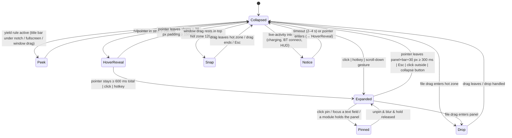

# Notch shell

**Tier P0 · Owner: `muna-shell-engineer` + `muna-ui-engineer` · Status: in progress (M1-E1 —
window manager, yield rules, tray, shell settings, state machine, strip and panel landed; the
Drop state arrived with Drop actions (M4-E1) and the Snap state with Window snap (M4-E3); the
Notice state arrives with the module that owns it)**

## Purpose

The always-running host that draws the notch on each enabled monitor, owns the collapsed strip
↔ expanded panel state machine, hosts modules, and handles Windows placement rules. Everything
else plugs into it.

## Reference

MacNotch screenshots `demo-01`, `live-feature-3/4`, `media-feature-5`; anatomy in
[`../reference/ui-observations.md`](../reference/ui-observations.md).

## Windows & processes

| Window | Purpose | Flags |
| -------- | --------- | ------- |
| `notch-<monitorId>` | One per enabled monitor. Hosts strip + panel + module bar in a single transparent WebView, sized to the max expanded bounds; hit-testing limited to painted regions. | `WS_EX_TOOLWINDOW`, `WS_EX_NOACTIVATE` (until a text field is focused), `WS_EX_TOPMOST`, `WS_EX_LAYERED`; `transparent: true`, `decorations: false`, `shadow: false`, `skipTaskbar: true`; `WDA_EXCLUDEFROMCAPTURE` when *Hide from captures* is on |
| `settings` | Standard decorated window (Mica if available). | normal |
| `overlay-eyebreak` | Full-screen dim overlay for Health eye breaks / Timer Done. | topmost, transparent, click-through except buttons |

Single process (Tauri core) + WebView2 renderer processes. A small **watchdog** thread restores
the native volume OSD and the AppBar reservation if the process dies unexpectedly (see HUD spec).

## States

Rules:

- Hover-intent uses the pointer's **velocity**: fast pass-throughs (> 800 px/s) never trigger
  HoverReveal. Reference apps use 300 ms intent (boring.notch) and 100 ms hover-out grace;
  Muna uses 250 ms / 300 ms with a 30 px extended hover padding around the shape so small
  pointer excursions don't collapse the panel.
- Expanded panel is dismissed by `Esc`, clicking outside, or the ⤡ button. `Pinned` (when a
  text field has focus or the user clicks the pin) disables auto-collapse. A module may also
  **hold** the panel (`usePanelHold`, since M5-E1b: the Health module while a guided flow
  runs): the hold pins like a focused field, without the pin button lighting up, is recorded
  even while the panel is closed so the next open pins at once, and lets go when the module
  says so. `Esc`, the ⤡ button and the hotkey still close a held panel.
- While `Expanded`, module switching via module bar, right rail, `Ctrl+Tab`/`Ctrl+Shift+Tab`,
  and per-module hotkeys. Global toggle hotkey default `Ctrl+Alt+Space`.
- Muna never steals focus unless the user clicks a text field (`WS_EX_NOACTIVATE` toggled).
- Hide/park transitions are debounced 500 ms so flapping fullscreen detection never flickers.

## Placement

- **Monitor enumeration**: `EnumDisplayMonitors` + `GetMonitorInfoW`; re-run on
  `WM_DISPLAYCHANGE` / `WM_DPICHANGED`; per-monitor DPI v2.
- **Horizontal anchor**: monitor centre + user offset (px). **Vertical**: top edge + user offset.
- **Modes**: *Overlay* (default) or *Reserved strip* (AppBar via `SHAppBarMessage` `ABM_NEW`,
  `ABM_QUERYPOS`, `ABM_SETPOS` on `ABE_TOP`; released on exit).
- **Yield rules (Overlay mode)**: foreground window rect (via `DwmGetWindowAttribute
  DWMWA_EXTENDED_FRAME_BOUNDS`) whose top ≤ strip bottom and horizontally overlapping the strip
  by > 40 % → `Peek`; fullscreen → hide (park), detected by `SHQueryUserNotificationState` ∈
  {BUSY, RUNNING_D3D_FULL_SCREEN, PRESENTATION_MODE} **or** the PILLAR heuristic: foreground
  rect covers ≥ 90 % of `rcMonitor` and the window has `WS_POPUP` or lacks `WS_CAPTION`
  (borderless video/game fullscreen; a maximised browser keeps its caption style and only
  triggers `Peek`). The desktop itself (`Progman`, `WorkerW`) is a borderless monitor-sized
  window that would pass the heuristic; it is exempt, so clicking bare wallpaper never parks
  the notch; `EVENT_SYSTEM_MOVESIZESTART` on any window → `Peek` unless the Window-snap
  module wants the hot zone.
- **Shapes**: *Notch* (flush to the top edge with 6 px *outward* top fillets — the flare of a
  real MacBook notch — and bottom radius 14 collapsed / 28 expanded, drawn as one SVG path with
  animatable radii) or *Island* (6–8 px top offset, all radii continuous; a constant 32 px
  `border-radius` is clamped to a capsule when collapsed and reads as 32 px corners when
  expanded, so the radius never needs animating).
- **Sizes**: strip height 32 (Default) · 26 (Compact) · 38 (Comfortable); strip width auto
  (min 190; reference apps use 185–200 × 32). Panel width clamps to `min(1000, monitorWidth −
  80)`. The window is sized to the maximum expanded bounds **plus 20 px shadow padding on every
  side and 8 % overshoot allowance** so springs and shadows are never clipped.

## Rendering & hit-testing

- Whole notch window is one WebView; the DOM paints only the notch shapes on a transparent
  canvas. Pointer events outside painted shapes are forwarded with
  `set_ignore_cursor_events(true)`; Rust samples `GetCursorPos` (60 Hz while the cursor is
  inside the window bounds, 10 Hz otherwise — Tauri has no hover-forwarding click-through,
  tauri #6164) and re-enables events when the cursor enters a shape bounds published by the UI
  (`shapeRects` IPC event). No `WH_MOUSE_LL` hook (silently removed on slow callbacks).
- First frame: window pre-sized with `SetWindowPos(SWP_ASYNCWINDOWPOS)`, created off-screen at
  (−10000, −10000) with `WEBVIEW2_DEFAULT_BACKGROUND_COLOR=00000000`, moved into place after the
  UI reports `ready`. The window is **never hidden/shown** afterwards (Tauri 2.x white-flash,
  #15490) — "hidden" states park it off-screen; `noRedirectionBitmap` adopted once stable.
- Fullscreen exclusive apps → window parked, renderer paused (`document.hidden`-like IPC
  event) to save CPU. Fullscreen is detected by a 500 ms `SHQueryUserNotificationState` poll
  plus foreground-rect == monitor-rect check (no change event exists). `QUNS_BUSY` alone is
  only a hint: other layered topmost utilities keep it set permanently (M0-E2 finding).
- Spike-validated numbers (Win11 25H2, [spikes/m0-window](../spikes/m0-window.md)): first
  paint 345 ms, park/unpark flash-free over 100 cycles and 22 monitor changes, click-through
  toggle ≈ 12–15 ms (median), top-most recovery ≈ 31 ms, quiet-state park ≈ 190 ms after the
  fullscreen window takes foreground, idle tree ≈ 100 MB private working set — but only with
  WebView2 launched as `--in-process-gpu --process-per-site` and the spare renderer disabled
  (`additionalBrowserArgs` on every window, ADR-0002); the default process model idles at
  181–223 MB.

## Settings (pane: Layout · Multiple Screens · Notch positioning · General)

Per monitor: enabled, mode, shape, offsets, strip height, width preset. Global: hide from
captures, launch at login (`StartupTask` when packaged, `HKCU\…\Run` otherwise), hover delays,
auto-collapse delay, default module, module order, accent colour, reduced motion (follow OS /
on / off), sounds.

## Accessibility

The strip is a named `role="region"` whose spoken description is a `role="status"` region,
`aria-live="off"` until Settings → Appearance → *Announce notices* turns it `polite` (M5-E3;
off by default because a track change every few minutes is noise for most listeners); the
expanded panel is
`role="dialog" aria-modal="false"` labelled by the active module title (or the app name when
no module is registered), and that title is the panel's one `h1` — module sub-headings are
`h2`; the module bar is a `tablist` of `tab`s with roving focus; all icon
buttons have `aria-label`; focus ring visible on keyboard navigation; `Esc` collapses; hotkey
to focus the panel (`Ctrl+Alt+Space` default); `Ctrl+Tab` / `Ctrl+Shift+Tab` step through
modules while the panel is open. Nothing traps focus. Settings → Appearance → *Increase
contrast* mirrors as `data-contrast="more"` on both windows' `<html>` alongside the Windows
contrast theme. (An earlier draft said the panel was a
`region`; the [design system](../05-design-system.md#accessibility) already said `dialog`,
so this spec was corrected in M1-E4 to match.)

## Acceptance criteria

- Given two monitors with different DPI, when the app starts, then a strip is centred on each
  enabled monitor within ±1 px and re-centres within 200 ms after resolution change.
- Given a maximised Chrome window, when Overlay mode is active, then the strip yields to Peek
  within 100 ms when Chrome is foreground and returns when Explorer/desktop is foreground.
- Given Reserved mode, when a window is maximised, then its top edge equals the strip's bottom.
- Given the pointer crosses the strip at > 800 px/s, then no HoverReveal occurs.
- Given *Hide from captures* is on, when `PrintScreen` is pressed, then the strip is absent
  from the capture (verified with `Windows.Graphics.Capture` in a test).
- Given an exclusive-fullscreen D3D app is foreground, then renderer CPU ≤ 0.1 %.

## Perf budget

Expand/collapse ≥ 58 fps; idle ≤ 0.3 % CPU; notch window RSS ≤ 90 MB.

### Memory target

The two webviews (notch and settings share one WebView2 renderer, same origin) are asked for
`ICoreWebView2_19::MemoryUsageTargetLevel(Low)` when nothing is moving, and for `Normal` the
instant something may: `shell/memory_target.rs` (pure, tested) decides, `ShellManager`
applies.

- **Low** after the cursor has been outside every notch window for 30 s
  (`MEMORY_LOW_AFTER`), while no hold is active.
- **Holds** (`Hold`): strip content that animates on its own — a playing waveform, a running
  timer, the wide text burst, any notice (`StripContent::animates()` in `muna-core`) — a
  *visible* settings window with focus, and a running camera preview (`Hold::MirrorPreview`,
  since M5-E1c: the mirror panel or widget reports it through `mirror_watch`). A still chip
  (paused media, a plain icon) does not
  hold, so the everyday "Spotify paused" desk still gets the trim. WebView2 creation hands the
  hidden settings window a focus event that no blur follows; the manager checks `is_visible`
  before counting it.
- **Normal** as soon as the cursor enters a notch window's bounds (the poll runs every 100 ms
  while idle, hover intent takes 250 ms more before anything reveals), when the strip content
  changes (`activities.rs` wakes the shell before it emits `StripContentChanged`), or when
  the settings window is focused. Every wake restarts the 30 s clock.
- **Observed** (release build, Win11 25H2, 165 Hz, 15.7 GB, locked desktop, docs/09 harness):
  the trim takes the tree from 118–123 MB private working set to 58 MB at once and to
  17–24 MB about 20 s later, as WebView2 purges caches and trims working sets; the page
  stays responsive throughout (rAF latency 0.2–1 ms, two-frame paint 8–12 ms, JS heap
  8.4 → 5.7 MB). Its cost lands in the perf harness's settling phase, which is reported and
  not gated (≈ 0.3 % of one core over 30 s here, 0.01 % normalised; up to 1.3 % of one core
  on the 4-vCPU runner, which is why the idle CPU gate reads the later steady state —
  [11](../11-ci-cd.md#performance-gates)). The first expand after a trim meets a cold
  renderer, so hover intent pre-renders the panel and, once a session, lays it out unpainted
  ([Implementation notes](#implementation-notes-m1-e1), "Morph and material"); the perf
  harness gates a session's first expand with the rest
  ([#81](https://github.com/miklol/Muna/issues/81)), where from
  [#71](https://github.com/miklol/Muna/issues/71) to #81 it was booked apart as
  `coldExpand`. Measured (release build, i9-13900HX laptop, 165 Hz panel, the docs/09
  harness's morph driver without CPU throttling): a session's first expand after a trim ran
  at 121–163 fps (98–110 before #81), and at 106–140 fps with the app pinned to four cores
  (102–103 before), with and without reduced motion; warm expands ran at 144–174 fps. Still
  to verify on hardware: the first morph after a trim
  (Low → Normal on hover, then 600 ms from the pointer reaching the strip to the expand)
  holds ≥ 58 fps on a 60 Hz 4-core laptop; the only panel here runs at 165 Hz.
  The `webview memory target target=Low|Normal windows=N` log line marks every transition;
  the perf harness keys its idle memory value on it.

## Implementation notes (M1-E1)

How the shipped shell interprets this spec; anything here that reads as a deviation was
decided during M1-E1 and is the behaviour to test against.

- **Split of responsibilities.** `apps/desktop/src-tauri/src/shell/model.rs` (`ShellModel`) owns
  every decision and runs against `muna_platform::FakePlatform` in `tests/shell_model.rs`;
  `manager.rs` is the Tauri glue (window creation, tray, hotkey, timers, event emission);
  `yield_rules.rs` is pure. The UI receives `ShellLayoutChanged { layout }` and
  `ShellYieldChanged { label, state }` (broadcast to every window with the target label in the
  payload) and asks `get_shell_layout` once on mount.
- **Ready is reported once per mount.** The UI calls `window_ready` after its first two
  frames; the shell answers every `window_ready` with a `ShellLayoutChanged` (and a `place` +
  top-most assert), so ready must never be re-armed by a layout change — M2-E4 found the
  `useShellReady` effect re-running on every layout event, which looped shell ↔ UI at half the
  display refresh (1652 `requestAnimationFrame` calls in 10 s, 31 % of one core idle). The
  store also drops a layout identical to the current one, and the morph frame sampler stops
  when the window parks mid-morph and after 5 s regardless. The shell logs
  `shell ready label=… since_start_ms=…` once per window; the perf harness reads it as the
  cold-start mark.
- **Peek is UI-driven, Park moves the window.** `Peek` only changes the yield state the UI
  renders; the window stays in place. `Parked` moves the window to the parked rect (fully above
  the monitor) and the UI pauses; nothing is ever hidden or shown.
- **Debounce.** Park ↔ unpark is debounced 500 ms per window (`ParkDebounce`); while a park is
  pending the strip shows *nothing new* (no Peek), so flapping detection cannot flicker. Peek is
  immediate.
- **Fullscreen is per monitor.** The foreground window is attributed to the monitor holding the
  largest part of it; only that monitor's notch parks. Lock, *Pause on display* and Presentation
  mode park regardless of the foreground window. Caption overlap applies in Overlay mode only;
  a window drag (`EVENT_SYSTEM_MOVESIZESTART`) peeks in both modes.
- **Maximising an already-foreground window** raises no foreground event; the 500 ms quiet-state
  poll re-samples the foreground rect, so that case yields within ≈ 500 ms rather than 100 ms.
- **Disabled monitor = parked, not destroyed.** Every monitor keeps a window (the config
  window `notch` cannot be re-created from its label); a monitor with *enabled: false* has its
  window parked and its UI paused. Windows are destroyed only when the monitor disappears.
- **Reserved mode** registers the `AppBar` only while the window is placed on an enabled,
  unpaused display; parking releases it, exit (`RunEvent::Exit`) releases all of them. The
  reserved height is `offsetY + shape offset + strip height`, in physical px.
- **Tray.** *Open settings* · *Pause on display ▸* (one check item per monitor) · *Quit Muna*.
  Left-click opens settings. Closing the settings window hides it; it opens by itself only on
  the very first launch and never when started with `--autostart`.
- **Toggle hotkey** (`shell.toggleHotkey`, default `ctrl+alt+space`) emits
  `ShellToggleRequested { label }` for the notch on the monitor under the cursor; the UI owns the
  expand/collapse.
- **Launch at login** goes through `platform.autostart()` (`StartupTask` with identity,
  `HKCU\…\Run` otherwise); when Windows refuses (task disabled by the user) the setting reverts
  and `SettingsChanged` is emitted.
- **The state machine is a pure reducer.** `apps/desktop/src/shell/machine.ts` —
  `transition(snapshot, event)` returns the next snapshot plus effects (timers, `setFocusable`,
  `blurField`); `ShellMachine` runs it against real or fake timers and `NotchWindow` only
  forwards DOM events and applies the effects. Every duration is read from `timings` in
  `@muna/ui/motion` (intent 250 ms, open at 600 ms from the pointer arriving, hover-out grace
  300 ms open / 150 ms revealed, velocity gate 800 px/s). `Drop` (M4-E1) and `Snap` (M4-E3)
  are in; `Notice` is added by the module that owns it. Both drag states are entered only
  from strip forms, ignore the pointer and panel controls while they hold, and close on Esc
  or Park; `Snap` waits out a 120 ms `snapIntent` timer (`timings.snapZonesDelayMs`) first and
  its hot zone is the rest box padded by `timings.snapHotZonePx`
  ([window-snap](window-snap.md#implementation-notes-m4-e3)).
- **Peek is a strip state.** Hover intent, press and scroll-down still apply while peeking, so
  resting on the 6 px sliver reveals and opens; closing returns to Peek or Collapsed according to
  the yield state.
- **The hotkey opens without auto-collapse** until the pointer has visited and left the panel;
  Esc, a press outside or the hotkey again close it. The toggle is per window (the notch on the
  monitor under the cursor).
- **Rect publishing.** The first published rect is always the strip at rest at its current
  width (wide form included): the yield rules measure caption overlap against it, so it follows
  neither Peek nor a morph. Strip states publish that rect alone; a second rect padded by the
  30 px hover margin covers the revealed or open shape and, while a morph is in flight, spans
  the current and the target bounds. Rust polls the cursor at the active rate while any window
  publishes more than one rect, so a press anywhere is seen within one tick.
- **Peek hit-testing.** Peek slides the strip up by `top offset + strip height − 6 px`
  (`PEEK_HEIGHT_PX`), so both shapes leave exactly the 6 px sliver at the top edge. Rust moves
  the window's first hit shape by the same amount while it peeks, so the caption band under the
  strip's rest position clicks through to the app behind and only the sliver stays interactive;
  the published rects are unchanged.
- **Press outside** is detected by Rust — a button rising edge while the cursor is outside
  every shape of a ready window emits `ShellPointerDownOutside { label }`, because the window
  is click-through there — and by the UI for a `pointerdown` on its own hover padding.
- **Pointer leave** is reported by the webview (`pointerleave` on the window's root) and by
  Rust: when a ready window turns click-through because the cursor left every shape it
  published, the cursor poll emits `ShellPointerLeft { label }` and the UI sends the machine
  the same `pointerLeave`. A leave while the pointer is already away changes nothing, so the
  two reports arm the grace timer once. The webview alone is not enough
  ([#75](https://github.com/miklol/Muna/issues/75)): the expand replaces the strip with the
  panel under a still cursor, and when the cursor's next move leaves the window before Blink
  has re-targeted the pointer — likely under load, as on a cold first expand on the 4-vCPU
  runner — Blink clears `:hover` but dispatches no `pointerout` or `pointerleave` anywhere.
  The machine then kept `pointerNear` and the panel stayed open until a press outside.
- **Morph and material.** One `NotchSurface` morphs its real width, height and offset under
  the springs of `@muna/ui/motion`; `morph-transition.ts` picks the preset from the previous
  and the next state, and reduced motion swaps the spring for the 150 ms ease-out (Motion then
  snaps the layout values and tweens only the radius). The
  panel material is applied when the panel shows and removed only once the collapse has
  settled at strip size, where both materials look alike. `morph-sampler.ts` samples each
  morph with `requestAnimationFrame` and `report_morph` logs `fps`, `frames`, `duration_ms`,
  `max_frame_ms` and `dropped`, the duration spanning the first to the last frame. A morph
  that spans no frame is not reported when it was instant — a mount, or under reduced motion
  one that leaves the radius where it is — or cut short within 20 ms (`SNAP_MIN_MS`); a tween
  that drew no frame is reported with `frames=0`, `fps=0` and its wall duration. So is a morph
  whose only frame began before the sample started: rAF stamps a frame with the time it
  began, which precedes the start when the morph started inside a long task after that frame
  was due. Its span would be negative, `report_morph` (unsigned fields) would reject it, and
  the panel would collapse with nothing in the log
  ([#75](https://github.com/miklol/Muna/issues/75)). A retarget
  that keeps the radius target — the panel's height, measured once it mounts, arriving
  mid-expand — continues the sample rather than starting one. Under reduced motion the
  retarget snaps and the radius tween in flight still ends the sample; a spring retarget
  replaces the motion in flight, so its own completion ends it. Before
  [#71](https://github.com/miklol/Muna/issues/71) the retarget restarted the sample; under
  reduced motion it was dropped as instant, which left a session's first expand unreported,
  and with the spring the report lost the frames before the retarget. While hover intent runs
  (`hoverReveal`, or the pointer near a collapsed or peeking strip) the panel and module bar
  are pre-rendered in a hidden React `Activity` (`shell/panel-warmup.tsx`) — idle priority,
  no effects, `display: none` — so the expand that follows mounts warm code (data fetches and
  subscriptions still start on the real mount); the copy goes when the panel shows or the
  pointer leaves. Until the shell knows the panel's height — so on a session's first hover
  intent — the copy is also laid out once when it reaches the document: React's
  `display: none` is lifted for one forced layout and put back in the same task, so no frame
  sees it. It lays out in an open, morphing `NotchSurface` of the panel's width, inside a node
  styled like the shell's measurement node, so it loads the panel's fonts, fills the
  text-shaping caches and measures the panel; that height stands in until the panel has
  measured itself. The copy differs from the panel only in its handlers, its pin icon (the
  same size) and a plain `size-full` div that stands in for the panel body's animated
  wrapper: on the release build both measured 961 × 360, and the panel reported that height
  from its first frame in every expand, with and without reduced motion, so the seed is exact
  and the expand does not retarget. Later hovers keep the plain hidden pre-render of #71,
  with no host, surface or observer around it: the cost is paid once a session, and a forced
  layout on every hover could land in the expand that follows if the idle-priority commit is
  late. That removes both costs of a session's first expand
  ([#81](https://github.com/miklol/Muna/issues/81)): the panel's first layout
  (34 ms against 4.6 ms warm, mostly fonts and text shaping, forced in the mount's commit by
  the module bar's width measurement) and the retarget to the measured height (a whole-shell
  re-render of 30–50 ms inside the morph). From #71 to #81 the harness booked that expand
  apart as `coldExpand` (39–49 fps on the nightly runner); it is now gated with the rest.
  Hover intent rather than the Low → Normal edge of the [memory target](#memory-target): the
  edge comes 250–400 ms earlier (window bounds versus the strip), but hover intent already
  leads the expand by up to 600 ms, which is more than the warm-up needs, and the edge would need a
  new event from Rust because the webview cannot see the cursor outside its shapes. The cold
  cost is also once per session, not once per trim: before this change, three expands in one
  session, each after a fresh two-minute Low hold, ran at 53, 72 and 92 fps (debug build, CPU
  throttled 2×, reduced motion), so warming on every Low → Normal edge would buy nothing the
  hover-intent warm-up does not, and hover intent also covers the first expand after launch.
- **Window size** is 1120 × 480 CSS px (`layout::WINDOW_LOGICAL`): panel max width plus the
  20 px shadow padding and the 8 % overshoot on each side, and the height of the tallest panel.
- **Focus.** The window keeps `WS_EX_NOACTIVATE` until a text field inside the panel takes
  focus (`set_notch_focusable(true)`, which also pins); Esc blurs the field and hands focus back
  before a second Esc closes.
- **Dev switches.** `scripts/dev.ps1 -HitTest` draws the published rects over the notch;
  `-FullMotion` ignores the OS *animation effects off* setting in dev builds so springs can be
  measured on a machine with reduced motion. Release builds always follow the OS, and the
  *Reduced motion* setting wins in every build. Only the hit-test overlay reads the rects in
  React state, so they are kept there only while it is on; elsewhere they go straight to
  Rust. Storing them re-rendered the whole shell, panel included, from the effect that
  publishes the in-flight rects, about 10 ms into every expand: a 16–21 ms task and a 33 ms
  frame in a debug build with the CPU throttled 2×
  ([#81](https://github.com/miklol/Muna/issues/81)).
- **Measured (Win11 25H2, 2560 × 1600 at 150 %, 165 Hz):** expand 158–167 fps, 110–116
  frames, 693–697 ms, max frame 6–24 ms, 0 dropped; collapse 157–167 fps, 123–131 frames,
  781–787 ms; peek slide 166–167 fps, 58–66 frames, 349–395 ms. Under OS reduced motion the
  layout snaps (0 frames) and only the radius tweens for 141–146 ms.
- **Yield rules on real windows.** The ten scripted scenarios of
  [qa/checklists/notch-shell.md](../qa/checklists/notch-shell.md) pass 10 / 10
  (`scripts/qa/notch-yield.ps1`, 2026-09-16, two monitors at 150 % and 100 %): Peek 30 ms after
  a foreground change, 422 ms after a silent maximise, 201 ms into a drag; fullscreen park
  510–893 ms with the 500 ms debounce and never during flapping; only the fullscreen monitor's
  notch parks; Reserved-strip work area exactly the strip's height.

## Implementation notes (M1-E4)

The panel chrome and the module bar as shipped by the M1-E4 PR.

- **Split.** `@muna/ui` owns the visuals: `PanelChrome` (header with title, subtitle and chips,
  a right rail of 28 px icon buttons whose right-most is always ⤡ collapse, a scrolling body
  and an optional footer) and `ModuleBar` (the 640 × 40 pill row with a shared-`layoutId`
  indicator, roving-tabindex `tablist`, drag and `Ctrl+Arrow` reorder, `Home`/`End`, and paging
  when more than sixteen modules register). Both have every-state stories and render tests.
  `apps/desktop/src/shell/panel.tsx` binds `PanelChrome` to the state machine (pin, collapse,
  title from the active module's `titleKey`); `notch-window.tsx` binds `ModuleBar` to the
  module registry and the store (`activeModuleId`, `moduleOrder`).
- **Geometry.** The bar hangs `12 px` (`shellSizes.moduleBarGap`) under the panel's bottom
  edge as a sibling of the morphing surface, riding the same height spring
  (`moduleBarOffsetY`), so it never lags or overshoots the panel. The published interactive
  rect unions panel and bar when at least one module is registered; the strip-at-rest rect is
  unchanged. Panel 360 + gap 12 + bar 40 (+ 8 island lift) fits the 480 px window, so
  `layout::WINDOW_LOGICAL` did not change.
- **Motion.** Bar enters with `expand` + 80 ms (y −12 → 0, opacity) and leaves with the panel
  (`contentExit`); a module switch keeps the panel open, springs the shell with `switch`
  (`morph-transition.ts` returns `switch` for a same-state transition under an open panel),
  and swaps bodies through `AnimatePresence mode="popLayout"` with `content` + 40 ms. Hover
  on a pill is `toggle` to 1.08 and back (see
  [motion spec → module switch](../06-motion-spec.md#module-switch)).
- **Keyboard.** `Ctrl+Tab` / `Ctrl+Shift+Tab` step through the ordered modules with wrap while
  the panel is open and at least two modules exist; plain `Tab` is left to the browser; arrows
  inside the bar move and activate; `Esc` on a pill cancels an in-flight drag, otherwise
  collapses as before.
- **Order.** `shell/module-order.ts` reconciles the saved order with the registry (unknown ids
  dropped, new modules appended) and resolves the active module (falls back to the first).
  Persistence of `moduleOrder` and `activeModuleId` to `settings.json` is deferred to M1-E3,
  which lands the settings write path; until then the order lives in the store for the
  session.
- **Empty registry.** With no modules the dialog is named after the app and the body shows
  `EmptyState` (`notch.empty.title` / `notch.empty.body`); no bar is rendered and the rects
  match M1-E1 exactly, which the S-suite still asserts.

## Open questions

- ~~Should Reserved mode be per-monitor or global?~~ Decided: per monitor (`MonitorLayout.mode`).
- Do we need a "hot corner" fallback for touch/pen users? (Backlog.)
- Two notch utilities cannot share the top-centre: another one running on the host (seen in
  [spike S2](../spikes/m4-drag.md), a Qt full-screen layered window above ours) takes the
  pointer and no event reaches Muna's strip. Diagnostics ([support](support.md)) should list
  the window that owns the pointer over the strip when it is not `MunaNotch`. (Backlog.)
